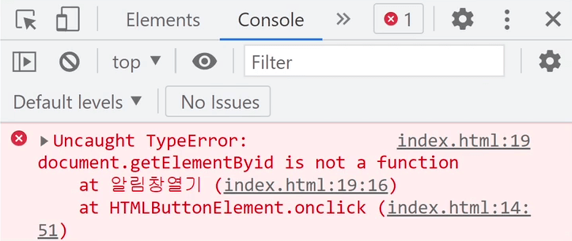

# 자바스크립트 function 문법
function (함수) 문법
---
- 문법 사용 이유

    - 함수는 길고 지저분한 코드를 한 단어로 축약하고 싶을 때 쓰는 문법

    - 특정 기능을 다음에도 쓰기 위해 모듈화해놓는 문법

- 사용법
```javascript
function 자유롭게작명(){
  축약하고 싶은 긴 코드
}
```
- function 키워드 쓰고 소괄호, 중괄호 추가

- 소괄호 왼쪽에 작명

- 긴 코드를 중괄호 안에 담기

- → 자유롭게작명() 쓸 때 마다 그 자리에 긴 코드 실행

<br>

---

<br>

Alert 여는 코드 function으로 축약
---
- 버튼의 onclick 안 긴 자바스크립트 코드를 함수 문법으로 축약

> html
```html
<button onclick="알림창열기()">알림창 여는 버튼</button>

<script>
  function 알림창열기(){
    document.getElementById('alert').style.display = 'block';
  }
</script>
```
- Alert 여는 코드를 function 안에 넣기

- 알림창열기() 라고 쓸 때 마다 function 안에 있는 긴 코드 실행

- 버튼 onclick 안에 길게 코드 작성하는 대신 단어하나 적으면 끝

<br>
 
### 💡 참고
- 함수 이름을 영어로 작명할 때 

    - 영어소문자로 시작

    - open_alert() 불가 
    
        - openAlert() 이렇게 붙여서 쓰는게 자바스크립트 관습(camelCase)

    - 한글작명도 가능

<br>

---

<br>

자주 겪는 에러들 
---
### 1. JS 코드는 밑에 작성
- 자바스크립트는 html 조작하는 언어

    - 조작할 html이 위쪽에 있어야 조작이 잘 됨

    - 자바스크립트를 조작할 html 위에 작성하면 X

        - 컴퓨터가 html 파일을 읽을 때 위에서 부터 한줄한줄 읽음

        - 미리 html을 읽어놔야 조작이 가능하기 때문

<br>

### 2. 오타주의
- 셀렉터 오타 주의

    - getElementById() 인데 i를 소문자로 쓴다든지..

    - getELementById('alert1111') 처럼 잘못된 id를 찾던지..

- 이상하게 코드짜면 에러 발생

    - 에러메세지는 브라우저 개발자도구 Console 탭에서 확인 가능

    - 브라우저에서 우클릭 - 검사 - Console탭

<br>

|예시1|
|-|
||

- Cannot read properties of null ~ 에러 

    - alert111 이런 식으로 id 이름이 잘못되었다는 뜻

<br>

|예시2|
|-|
||

- ~ is not a function

    - 함수명이 잘못되었다는 뜻

- getElementById() : 소괄호 붙는거 보니까 함수

    - 여기에 오타났다는 뜻

<br>

### 3. 에러 발생시 해결 방법

- 오타났다고 알려주는 메세지 보고 "디버깅" 진행

    - 디버깅 : 버그없애는 작업

- 에러메세지 그대로 구글, gpt 찾아보기


<br>