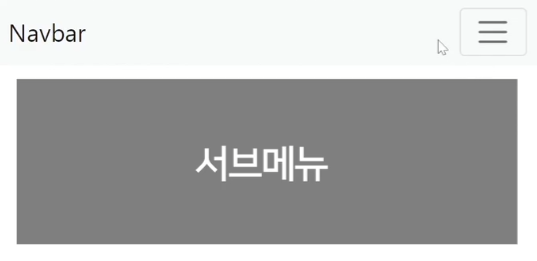

# 서브메뉴와 classList
버튼누르면 등장하는 서브메뉴 생성
---

|서브메뉴 UI|
|-|
||

<br>

---

<br>

Bootstrap 설치
---
- Bootstrap css 파일 설치해놓으면 버튼, 탭, 메뉴 등을 복붙식으로 개발 가능

- 구글에 bootstrap 검색하면 나오는 첫 사이트 접속 후 get started 버튼 클릭

<br>

### 1. 우측 위에서 버전이 5.X 버전인지 확인 후 링크 복사

> html
```html
<link href="https://cdn.jsdelivr.net/npm/bootstrap@5.1.3/dist/css/bootstrap.min.css" rel="stylesheet">

<script src="https://cdn.jsdelivr.net/npm/bootstrap@5.1.3/dist/js/bootstrap.bundle.min.js"></script>
```

<Br>

### 2. css 파일은 <head> 태그 안에 붙여넣기

<br>

### 3. js 파일은 <body>태그 끝나기 전에 붙여넣기

<br> 

- 잘 모르겠으면 [starter template 항목에 있는 예제코드](https://getbootstrap.com/docs/5.1/getting-started/introduction/#starter-template)를 html파일로 적용

    - css 파일도 \<link>태그로 넣기

<br>

---

<br>

Navbar 만들기
---
- Bootstrap 설치했으면 그 사이트에서 원하는 웹 UI 검색해서 복붙

- 상단 메뉴(Navbar) 검색해 붙여넣기

> html
```html
<nav class="navbar navbar-light bg-light">
  <div class="container-fluid">
    <span class="navbar-brand">Navbar</span>
    <button class="navbar-toggler" type="button">
      <span class="navbar-toggler-icon"></span>
    </button>
  </div>
</nav> 
```

<br>

### 버튼 누르면 등장하는 서브메뉴

- 미리 html css로 디자인 해놓고 숨기기

- 버튼누르면 보여주기

- 디자인은 Bootstrap 홈페이지에서 list group \<nav> 밑에 복붙

> html
```html
<ul class="list-group">
  <li class="list-group-item">An item</li>
  <li class="list-group-item">A second item</li>
  <li class="list-group-item">A third item</li>
  <li class="list-group-item">A fourth item</li>
  <li class="list-group-item">And a fifth one</li>
</ul> 
```
- 서브메뉴의 html css 디자인 완성 

<br>

### class 탈부착
- 버튼 누르면 보여달라고 코드 작성

> css
```css
.list-group {
  display : none
}
.show {
  display : block
}
```
- css 파일 열어서 평소에 .list-group 붙은 요소는 숨겨놓기

- 거기에 show 클래스 부착하면 보여주는 식으로 개발

- 버튼누르면 \<ul class="list-group"> 에다가 show 클래스 부착하라고 코드짜면 서브메뉴 UI 완성

- class 부착 이유

    - 나중에 display : block 말고 다른 스타일도 동시에 주고 싶을 경우 유용하기 때문

<br>

---

<br>

버튼 클릭시 클래스명 추가
---
> class명을 원하는 요소에 추가하는 방법
```javascript
셀렉터로찾은요소.classList.add('클래스명') 
```

<br>

> class명을 원하는 요소에서 제거하는 방법
```javascript
셀렉터로찾은요소.classList.remove('클래스명')
```

<br>

> class="navbar-toggler" 가진 요소 클릭하면 class="list-group"인 요소에 show 클래스명 추가

```javascript
document.getElementsByClassName('navbar-toggler')[0].addEventListener('click', function(){
  document.getElementsByClassName('list-group')[0].classList.add('show');
});
```
- class="navbar-toggler" 가진 요소 클릭하면

    - class="list-group"인 요소에 show 클래스명 추가

<br>

---

<br>

버튼 한 번 더 누르면 숨기기
---
- 버튼 한 번 더 누르면 show 클래스를 제거

    - if문, 변수문법을 배우면 직접 만들어볼 수 있음

<br>

> 더 쉬운 방법
```javascript
document.getElementsByClassName('navbar-toggler')[0].addEventListener('click', function(){
  document.getElementsByClassName('list-group')[0].classList.toggle('show');
});
```
- .classList.toggle()

    - 클래스명이 있으면 제거

    - 클래스명이 없으면 붙임

    - 왔다갔다하는 UI 만들 때 유용

<br>

---

<br>

querySelector
---
- getElementById(), getElementsByClassName() 말고 다른 방식으로 html 요소를 찾아주는 셀렉터

> html
```html
<div class="test1">안녕하세요</div>
<div id="test2">안녕하세요</div>

<script>
  document.querySelector('.test1').innerHTML = '안녕';
  document.querySelector('#test2').innerHTML = '안녕';
</script>
```
- querySelector() 안에는 css 셀렉터 문법을 사용가능

    - css에서 마침표는 class라는 뜻, #은 id라는 뜻

    - 다만 querySelector() 는 맨 위의 한개 요소만 선택

<br>

> ex
```html
<div class="test1">안녕하세요</div>
<div class="test1">안녕하세요</div>

<script>
  document.querySelectorAll('.test1')[1].innerHTML = '안녕';
</script>
```
- test1 클래스가 중복으로 여러개 있는데 X번째 요소를 선택하고 싶은 경우

    - querySelectorAll() 사용

- querySelectorAll() : 해당하는걸 다 찾아서 [] 안에 담아줌

    - [숫자] 를 뒤에 붙여서 원하는 위치에 있는 요소 찾아 사용 


<br>

