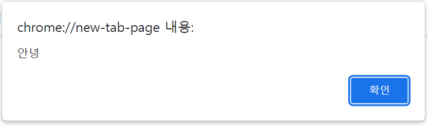
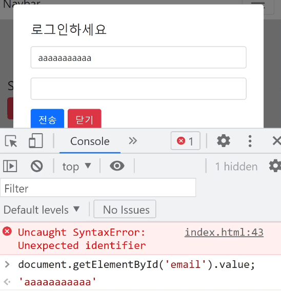
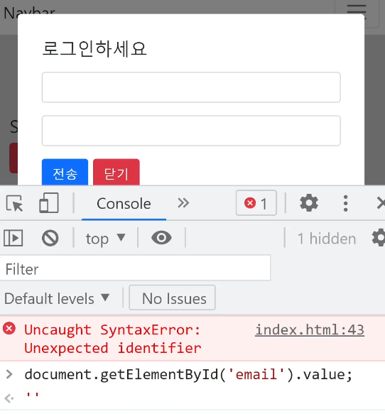

# if else else if
\<form> 만들기 
---
> html
```html
<form action="success.html">
  <div class="my-3">
    <input type="text" class="form-control">
   </div>
   <div class="my-3">
     <input type="password" class="form-control">
   </div>
   <button type="submit" class="btn btn-primary">전송</button>
   <button type="button" class="btn btn-danger" id="close">닫기</button>
</form>
``` 
- 모달창 안에 폼 생성

- success.html 파일도 같은 폴더에 생성 

- 전송버튼 누르면 폼 전송이 되며 success.html 로 이동

<br>

### 제한 걸기 
- 첫 \<input>에 입력한 값이 아무것도 없으면 전송버튼 누를 때 알림 띄우기

> 자바스크립트
```
전송버튼누르면
저기 <input>에 입력된 값이 공백이면 알림띄워주세요 
```
- 자바스크립트 if 문법

 
<br>

---

<br>

if else 조건문
---
> 조건부 코드 실행시 if 문법 사용
```javascript
if (조건식){
  실행할코드
}
```
- 조건식이 참일 때 중괄호 안에 있는 코드 실행

<br>

> if
```javascript
if (3 > 1){
  console.log('안녕')
}
```
- 콘솔창에 '안녕' 출력

    - 조건식란엔 대부분의 경우엔 등호, 부등호 들어감 

 
> else
```javascript
if (3 < 1){
  console.log('안녕')
} else {
  console.log('안녕2')
}
```
- `조건식이 참이 아니면 이거 실행해달라`고 코드 작성하려면

    - else 조건문 사용 ⇒ if 뒤에만 붙일 수 있음

- 콘솔창에 '안녕2' 출력
 

 
<br>

---

<br>
 
alert 함수
---

|alert 함수|
|-|
||

- 간단한 알림팝업 띄우고 싶으면 alert('문구')

<br>

### 전송버튼 누르면 공백 체크
- 첫째 \<input>에 입력한 값이 공백이면 alert('아이디입력하세요') 라고 안내문 띄우기

> 전송버튼 클릭시
```javascript
$('form').on('submit', function(){
  input에 입력한 값이 공백인 경우 알림 띄우기
});
```
- 이벤트리스너 위치
    
    - 버튼에 click 이벤트리스너 달거나 
    
    - \<form>태그 찾아서 submit 이벤트리스너 달거나

        - 폼전송이 되면 \<form> 태그에서 submit 이벤트도 발생

- 태그명으로 찾고 싶으면 마침표나 # 없이 $('태그명')만 기재

 
 
<br>
 
> input 에 입력한 값이 공백인 경우 알림 띄우기
```javascript
$('form').on('submit', function(){
  if (input에 입력한 값이 공백) {
    alert('아이디 입력하세요');
  }
});
```
- input에 입력한 값 찾는 법

    - document.getElementById('인풋태그찾고').value

 
|value 잘 나오는지 확인|
|-|
||
|\<input> 태그에 id="email" 주고 출력해본 결과|
||
|\<input> 태그에 아무것도 안썼을 땐 따옴표 2개(공백)|

<br>

> 최종 코드
```javascript
$('form').on('submit', function(){
  if (document.getElementById('email').value == '') {
    alert('아이디 입력하세요');
  }
});
```
- jQuery : $('#email').val() == ''

<br>

---

<br>

폼 전송 막는 법
---
> javascript
```javascript
$('form').on('submit', function(e){
  if (document.getElementById('email').value == '') {
    e.preventDefault();
    alert('아이디 입력하세요');
  }
});
```
- 이벤트리스너 콜백함수에 e라는 파라미터 추가

    - e.preventDefault() : 폼 전송 막기

<br>

---

<br>


else if 문법
---
- if문 뒤에 원하는 만큼 붙일 수 있음

> javascript
```javascript
if (1 == 3) {
  console.log('맞아요1')
} else if (3 == 3){
  console.log('맞아요2')
}
```
- else if : `그게아니면 만약에` 라는 뜻

- 1 == 3 비교해보고 그게 아니면 3 == 3 비교

    - 참이면 맞아요2 출력 

<br>

> javascript
```javascript
if (1 == 3) {
  console.log('맞아요1')
} else if (3 == 3){
  console.log('맞아요2')
} else if (4 == 4){
  console.log('맞아요3')
}
```
- 결과 : 맞아요2
 
- else if 문의 경우 else 문의 특징도 가지고 있음

    - 조건식이 참이면 뒤에오는 else if문은 실행 X 


<br>
 
> javascript
```javascript
if (1 == 3) {
  console.log('맞아요1')
} else if (3 == 3){
  console.log('맞아요2')
} 
if (1 == 3) {
  console.log('맞아요1')
} 
if (3 == 3){
  console.log('맞아요2')
} 
```
- else if 문 안쓰고도 if문 2개만 써도 똑같은 기능 구현 가능

- else if 문 존재 이유

    - if문만 2개 있으면

        - 위에 있는 if문이 참이든 아니든 둘째 if문도 항상 실행

    - if + else if가 있으면

        - else 덕분에 위의 조건식이 참이면 else 뒤는 스킵

- 조건식을 여러번 검사하는데 중간에 참이 나올 경우 코드실행을 중단하고 싶으면 else if 사용

 

설명만 들으면 의미없기 때문에 오늘 숙제해보면서 한번 활용해보시길 바랍니다. 

 

 

 

 

 

 

 

오늘의 숙제 : 

1. 전송버튼 누를 때 아이디랑 패스워드 둘 다 공백검사하려면?

이건 답인데 누르면 안됩니다
 

2. 전송버튼 누를 때 입력한 비번이 6자 미만이면 알림띄우기

글자가 몇자인지 출력하는건 구글이 압니다
 