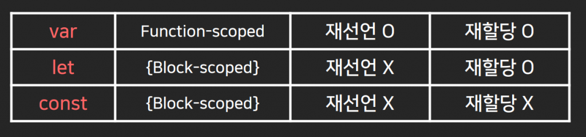

# 변수문법과 Dark mode 버튼만들기

다크모드 버튼
---
- 누르면 사이트가 어두워짐

- 어두워지는 class를 css 파일에 미리 만들어놓고 버튼누르면 부착

<br> 

> html
```html
<span class="badge bg-dark">Dark 🔄</span>
```
- 버튼부터 생성

    - ms-auto mx-3 : 우측정렬

- 버튼 클릭시

    - 버튼 1회 누르면 안의 글씨가 Light로 바뀜

    - 2회 누르면 다시 Dark

    - 3회 누르면 다시 Light

    - 4회 누르면 다시 Dark

- 버튼누른 횟수 기록해두기

<br>
 
---

<br>

자료를 잠깐 저장할 수 있는 변수문법
---
- 자료를 잠깐 저장하고 싶으면 변수문법 사용

    - var 변수명 = 넣을값; 

 
> javascript
```javascript
var 나이 = 20;
var 이름 = 'kim';
```
- 20과 'kim'을 변수에 저장

    - 나이, 이름이라고 쓸 때 마다 그 자리에 20과 'kim' 들어감

        - 콘솔창에서 확인 가능

- 문자, 숫자 말고도 거의 모든걸 다 넣을 수 있음

    - document.getElementById() 도 변수에 넣어쓰기 가능

- 영어로 작명시엔 함수 작명하듯 camelCase

 
<br>

---

<br>

변수 사용 이유
---

### 1. 길고 복잡한 자료를 변수에 저장해서 쓰면 편리
> ex
```
사이트 만드는데

'안녕하세요 반갑습니다 오랜만인데 그동안 잘지냈니' 
라는 인삿말이 매우 자주 필요하다고 가정 

var 인삿말 = '안녕하세요 반갑습니다 오랜만인데 그동안 잘지냈니';
이렇게 저장해두면 필요한 부분에 인삿말이라고 쓰면 끝
```

<br>

### 2. 특정 값을 기록하고 싶으면 변수 사용
> ex
```
버튼을 1번 누르면 Dark로 글자가 바뀌어야하고
버튼을 2번 누르면 Light로 글자가 바뀌어야함

→ 버튼누른 횟수를 어딘가에 기록해놓으면 편리

var count = 0;

변수 만든 후버튼누를 때 마다 count를 1 증가시키기
```

<br>

---

<br>

변수에 +1 하는 법
---
- 기존 값에 +1 하고 싶으면 

    - 변수명++

    - 변수 += 1

    - 변수 = 변수 + 1

> 확인
```javascript
var count = 0;
count++;
console.log(count);
```

<br>

---

<br>
 
> 버튼 누를 때마다 버튼 글자 Light, Dark 변경
```javascript
```javascript
var count = 0;

$('.badge').on('click', function(){
  count += 1;
  if (count % 2 == 1) {
    $('.badge').html('Light');
  } else {
    $('.badge').html('Dark')
  }
});
```
- jQuery로 찾은 요소 innerHTML을 바꾸고 싶으면 .html('바꿀내용')

- 실제 다크모드처럼 사이트 어둡게 만들기

    - 부착하면 어두워지는 class 생성

        - Bootstrap 스타일이 적용된 요소는 css 덮어쓰기 어려움

            - bg-dark 클래스명을 bg-light 로 변경

            - 붙어있던 class 제거

    - 버튼누를 때 class 부착


<br>

---

<br>

변수의 선언, 할당, 범위
---
- 선언과 할당

    - 변수만드는 것 : 선언

    - 변수에 집어넣는 것 : 할당

<br>

> 변수의 선언 
```javascript
var 나이;
var 이름;
```

<br>

> 변수의 할당
```javascript
var 나이;
var 이름;
나이 = 20;
이름 = 'kim';
```
- 밑의 2줄이 할당

- 선언만 따로, 할당만 따로 할 수 있음

- 이미 있는 변수 재선언 가능

- 이미 들어있는 값을 등호로 재할당 가능

<br>

> 변수의 범위
```javascript
function 함수(){
  var 나이 = 20;
  console.log(나이); //가능
}

console.log(나이); //불가능
```
- 변수는 사용가능한 범위 존재

    - 함수 안에서 변수를 만들었을 경우 함수 안에서만 사용가능

        - 밖에선 사용불가능
        
            - 밖에서 출력하면 변수가 정의 안되었다고 에러 발생

    - 함수 바깥에서 만든 변수는 함수 안에서는 사용가능

<br>

---

<br>
 

var let const 문법 전부 변수생성 가능
---
- var 대신 let, const 문법 써도 변수생성이 가능

> let, const 기능
```javascript
let 거주지 = 'seoul';
const 가격 = 3000;
let 거주지; //에러
가격 = 4000;  //에러
```
- let, const는 재선언 불가능

    - 재선언하면 에러 발생

- 장점

    - 코드 길게 짜다보면 변수 중복 실수 발생

        - 실수를 미연에 방지해주는 변수생성 키워드

 
- const는 재할당도 불가능
    
    - 재할당하면 에러 발생

- 장점

    - 값을 수정하면 큰일나는 변수들을 만들고싶을 때 유용

        - 나중에 값을 변경하는 실수를 방지하고 싶을 때 사용

<br>

---

<br>
 
> let, const 범위
```javascript
if (true) {
  let 이름 = 'kim';
}

console.log(이름); //없다고 나옴
```
- let과 const는 범위가 더 좁음

    - 모든 중괄호가 범위

- if, function, for 반복문은 중괄호가 존재

    - 중괄호 안에서 만든 let const 변수의 경우 중괄호를 벗어나면 없다고 나옴

<br>


|최종 정리|
|-|
||

- var 변수는 유연해서 재선언 재할당이 자유로움

 
