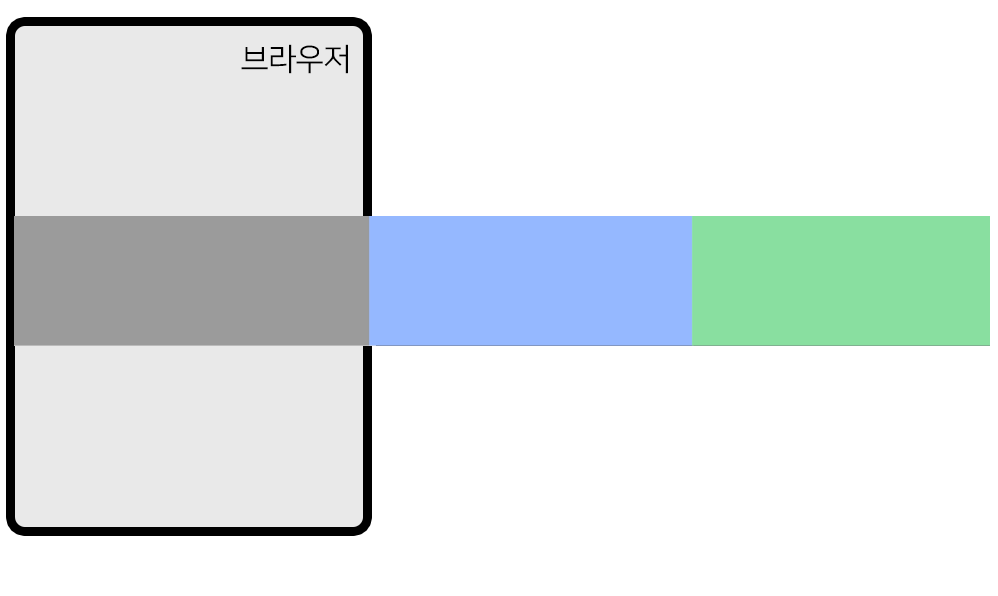

# 캐러셀 (이미지 슬라이드)
one-way 애니메이션들어간 UI 만드는 법
---
```
1. 애니메이션 시작 전 화면 만들기

2. 애니메이션 종료 후 화면 만들기

3. 언제 종료화면으로 변할지 JS 코드짜기

4. transition 추가하기 
```

<br>

---

<br>

캐러셀
---
- 슬라이드되는 UI들

<br>

### 1. 애니메이션 시작 전 화면 만들기


▲ 사진이 이렇게 슬라이드되어서 보이려면?

|-|
|-|
||

- 사진을 가로로 길게 배치

    - 나중에 전체를 왼쪽으로 이동

<br> 

> html
```html
<div style="overflow: hidden">
    <div class="slide-container">
      <div class="slide-box">
        
      </div>
      <div class="slide-box">
        
      </div>
      <div class="slide-box">
        
      </div>
    </div>
 </div> 
 ```

> css
```css
.slide-container {
  width: 300vw;
  transition: all 1s;
}
.slide-box {
  width: 100vw;
  float: left;
}
.slide-box img {
  width: 100%;
} 
```
- 이미지 3개가 가로로 배치됨 

- vw 단위 : 브라우저 폭에 비례한 단위

    - 100vw : 브라우저 폭의 100%

- 애니메이션 UI 만들기 step 4인 transition은 미리 추가해둠 

<br>

### 2. 애니메이션 종료 후 화면 만들기
- 2번 버튼 누르면 2번 사진이 슬라이드되어서 보일 것

    - 최종화면 생성

- html 요소를 왼쪽으로 이동

    - margin-left 아니면 transform 속성 사용 

<br>

> css
```css
.slide-container {
  width: 300vw;
  transition: all 1s;
  transform: translateX(-100vw);
} 
```
- 가로로 긴 박스에 transform: translateX(-100vw); 

    - 2번사진이 슬라이드되어서 잘 보임

        - 종료화면

- class로 만들어두고 부착 or 자바스크립트로 직접 부여

<br>

### 3. 언제 종료화면으로 변할지 JS 코드짜기
> javascript 
```javascript
$('.slide-2').on('click', function() {
  $('.slide-container').css('transform', 'translateX(-100vw)');
});
```
- 버튼2 누르면 최종화면으로 변하라고 코드 작성

- jQuery로 찾은 요소에 .css() 주면 style 속성 변경 가능

<br>

### 4. transition 미리 작성하여 캐러셀 완성

<br>

---

<br>
 
버튼1 버튼3 기능 만들기
---
- 버튼1 누르면 css 이렇게 수정해달라고 코드 작성

- 버튼1 눌러서 1번사진을 보여주고 싶으면 transform : translateX(0vw) 추가

    - 아니면 transform 아예없애거나

- 버튼3 눌러서 3번사진을 보여주고 싶으면 transform : translateX(-200vw) 추가

<br>
 
> javascript
```javascript
$('.slide-1').on('click', function() {
  $('.slide-container').css('transform', 'translateX(0vw)');
});

$('.slide-2').on('click', function() {
  $('.slide-container').css('transform', 'translateX(-100vw)');
});

$('.slide-3').on('click', function() {
  $('.slide-container').css('transform', 'translateX(-200vw)');
});
```

<br>

---

<br>

다음버튼 만들기
---
- 버튼을 누르면 다음 사진이 보이는 기능

    - 다음버튼 클릭시

        - 지금보이는 사진이 1이면 2번사진 노출

        - 지금보이는 사진이 2면 3번사진 노출

<br>

> html
```html
<button class="next">다음</button>
<script>
  $('.next').on('click', function(){
    if (지금보이는 사진이 1이면) {
      2번사진 보여주세요~
    }
  })
</script>
```
- 지금 보이는 사진이 1인지 2인지 판단하려면

    - 사진이 바뀔 때마다 직접 기록

        - 포스트잇 붙여놓고 지금 몇번사진 보고있는지 숫자로 기록해놓으면 필요할 때 꺼내쓸 수 있음

        - 프로그래밍용 포스트잇 = 변수

 
<br>

> html
```html
<button class="next">다음</button>
<script>

  var 지금사진 = 1;

  $('.next').on('click', function(){
    if (지금사진 == 1) {
      $('.slide-container').css('transform', 'translateX(-100vw)');
    } 
    else if (지금사진 == 2){
      $('.slide-container').css('transform', 'translateX(-200vw)');
    }
  })
</script>
```
- 사진은 바뀌는데 포스트잇은 업데이트 X

<br>

> var 지금사진 = 1; 수정
```html
<button class="next">다음</button>
<script>

  var 지금사진 = 1;

  $('.next').on('click', function(){
    if (지금사진 == 1) {
      $('.slide-container').css('transform', 'translateX(-100vw)');
      지금사진 += 1;
    } 
    else if (지금사진 == 2){
      $('.slide-container').css('transform', 'translateX(-200vw)');
      지금사진 += 1;
    }
  })
</script>
```
- 다음버튼 누를 때 마다 지금사진을 +1 하라고 추가

- 지금사진이 1일 때 다음버튼누르면 

    - 2번사진 보임

    - var 지금사진이 +1 됨 


<br>


### 💡 사진이 n개가 되어도 다음버튼 기능이 잘 동작하려면?
- 사진 갯수와 상관없이 잘 동작하는 코드

    - if문 추가

    - 코드 규칙성 파악

<br>

> 다음버튼 클릭시 규칙성 파악
```
if 지금사진이 1이면 -100vw 이동

if 지금사진이 2면 -200vw 이동

if 지금사진이 3이면 -300vw 이동

...
```
- `다음버튼 누르면 'translateX(-지금사진vw)' 만큼 이동해달라`고 코드 작성 

<br>

> html
```html
<button class="next">다음</button>
<script>

  var 지금사진 = 1;

  $('.next').on('click', function(){
      $('.slide-container').css('transform', 'translateX(-' + 지금사진 + '00vw)');
      지금사진 += 1;
  })
</script>
```

<br>

#### 🚨 문자 중간에 변수를 집어넣고 싶으면
> 방법1
```javascript
var count = 1;
console.log('문자' + count + '문자')
```
- `문자1문자` 출력

- \+ 기호를 사용할 때 적어도 1개가 문자가 있으면 수학덧셈이 아니라 문자덧셈

    - 문자덧셈 : 좌우를 붙여줌

<br>

> 방법2
```javascript
var count = 1;
console.log('문자' + count + '문자');
console.log(`문자${count}문자`)
```
- `문자1문자` 출력

- 물결기호 밑에 있는 백틱기호로 문자를 만들면 

    - 문자중간에 ${변수} 이런 식으로 변수를 넣을 수 있음

<br>

 

 