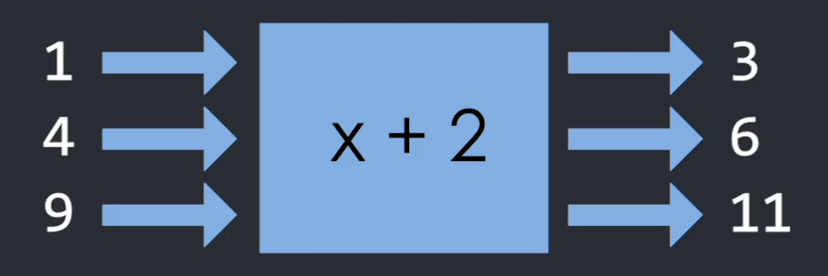
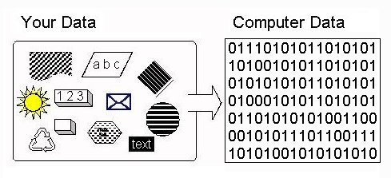

# 함수의 return 문법 & 소수


함수 function 문법
---
- 긴 코드 짧게 축약해서 쓸 수 있음

- 파라미터로 기능 업그레이드 가능

- return을 쓰면 함수를 쓰고나서 원하는 값을 그 자리에 뱉을 수도 있음

<br>

---

<br>

함수안에서 쓸 수 있는 return 문법
---
- return 오른쪽에 아무거나 적으면 

    - 함수가 실행되고난 자리에 return 오른쪽에 있던 값이 남음

<br>

> 용도1
```javascript
function 함수(){
  return 123
}

console.log(함수());
```
- 함수() 실행하고나서 123을 남기라고 기재

    - `123` 출력

- 함수() 실행하고 나서 그 자리에 뭔가 결과를 남기고 싶으면 return 문법 사용

<br>

> 용도2
```javascript
function 함수(){
  console.log('안녕');
  return 123
  console.log('반가워');
}

함수();
```
- return 문법은 함수종료의 뜻도 가짐

- 함수안에 코드가 길면 위에서부터 한줄한줄 실행

    - return을 만나면 함수 바로 종료

- `console.log('반가워');` 실행 X

<br>
 
---

<br>

사용 이유
---
- 프로그래밍의 함수문법은 수학의 함수문법과 용도가 같음

 

|수학에서의 함수|
|-|
||

- 숫자를 집어넣으면 규칙에 따라 다른 숫자가 나오는 변환기 역할

    - x 집어넣으면 x + 2 나오는 변환기 역할을 하는 수식

- 프로그래밍에서의 함수도 마찬가지

    - 자료를 집어넣으면 규칙에 따라 다른 자료가 나오는 변환기 역할

- 변환기 만들 때 return 문법 유용하게 사용

<br>

---

<br>
 

ex) 부가세 계산기 만들기
---
- 상품가격의 부가세를 구할 일이 자주 있다고 가정

<br>

- 6만원, 5만원, 8만원짜리 상품의 부가세를 구해 콘솔창에 출력

> 방법1
```javascript
console.log(60000 * 0.1);
console.log(50000 * 0.1);
console.log(80000 * 0.1);
```
- 필요할 때 마다 0.1을 곱해주기

<br>

> 방법2
```javascript
function vat(a){
  return a * 0.1
}

console.log(vat(60000));
console.log(vat(50000));
console.log(vat(80000));
```
- 자주 필요하거나 수식이 복잡하면 함수를 만들어쓰는 것이 좋음

- 1. vat 함수 생성

    - x를 집어넣으면 x * 0.1 이 그 자리에 남음 
    
    - 부가세구하는 역할

- 2. 부가세 구하고 싶을 때 마다 vat() 사용

<br>

- 그 외 return 문법을 사용한 유용한 변환기

    - 숫자를 넣으면 3의 배수 여부를 true/false로 뱉는 함수

    - 문자를 넣으면 a가 몇개 들어있는지 뱉는 함수 


<br>

---

<br>

자바스크립트에서 소수 연산시 주의점
---

|-|
|-|
||

> javascript
```javascript
console.log(1.1 + 0.3)
```
- 실행하면 1.4가 나올 것 같지만 `1.40000000001` 출력

    - 컴퓨터는 2진법으로 설계되어있음

        - 숫자도 2진법으로 바꾼 숫자만 알아들을 수 있음

- 컴퓨터에게 10 + 20 연산하라고 하면

    - 전부 2진법으로 바꿔서 1010 + 10100 으로 연산하고 다시 10진법으로 바꿔서 출력 

- 2진법의 문제

    - 1.1 이런 숫자는 2진법으로 바꾸면

        - 1.00011001100110011001100 ... 패턴 무한 반복

        - 이 세상엔 무한한 숫자를 저장할 수 있는 저장장치는 없음

    - 컴퓨터는 적절히 끊고 반올림해서 저장

        - 1.00011001100110011001101

    - 소수들끼리의 연산은 아주 작은 오차가 발생할 수 밖에 없음

- 2진법의 문제 해결

    - 덧셈하기 전에 10 곱해서 덧셈하고 10으로 나누기

    - 외부라이브러리 사용

    - 오차는 무시할 정도로 작으니 그냥 반올림

<br>

---

<br>

소수점 반올림하는 법
---
> javascript
```javascript
console.log( (1.1 + 0.3).toFixed(1) );
```
- 숫자.toFixed(몇자리) 

    - 모든 숫자 뒤에 붙일 수 있음

- 주의 : 이렇게 하고 나면 '문자'로 변환해줌

    - '123'과 123은 다른 타입이라 주의해서 사용

<br>

---

<br>

'숫자'를 숫자로 변환하고 싶으면 
---
> javascript
```javascript
parseFloat('123')
parseInt('123') 
```
- `123`을 그 자리에 남겨줌

    - 문자처럼생긴 숫자를 숫자로 변경해주는 함수

- parseInt() : 정수로 변환

- parseFloat() : 실수로 변환

- 자바스크립트는 덧셈기호가 좀 특이한 역할을 함

    - 1 + 1 은 2지만 

    - 1 + '1' 은 '11'

        - \+ 기호 사용시 둘 중 적어도 하나가 문자가 있으면 문자덧셈 진행

        - 문자덧셈 : 문자두개 이어붙여줌 

<br>

---

<Br>

함수에 분과 초를 차례로 파라미터로 입력하면 ms단위로 바꿔주는 함수
---
- 1초 == 1000ms

<br>

> 동작예시1
```javascript
console.log(함수(1,30))
```
- 콘솔창에 `90000` 출력

    - 1분 30초는 총 90초

    - x 1000 하면 ms단위로 바꿀 수 있으니까 90000

<br>
 
> 동작예시2
```javascript
console.log(함수(2,10))
```
- 콘솔창에 `130000` 출력

    - 총 130초인데 x 1000 하면 ms 단위로 바꿀 수 있으니까 130000

<br>

> 정답
```javascript
function 함수(a, b){
  var result = (a * 60 + b) * 1000;
  return result
}
```

 

<br>

---

<br>

격을 파라미터로 입력하면 10% 할인된 가격을 반환하는 함수
---
- 첫 구매여부도 true/false로 둘째파라미터에 입력

    - 첫 구매가 맞을 경우 추가로 1.5 달러 할인

- 주의 : 가격으로 실수 넣으면 소수로 인한 오차도 발생

    -  오차는 깔끔하게 처리

<br>

> 동작예시1
```javascript
console.log(함수(70, false))
```
- 콘솔창에 `63` 출력

    - 70의 10% 할인가, 추가할인 X

<br> 

> 동작예시2
```javascript
console.log(함수(10, true))
```
- 콘솔창에 `7.5` 출력

    - 10의 10% 할인가격 9에 추가할인 1.5

<br>

> 정답
```javascript
function 함수(a, b){
  var result = a * 0.9;
  if (b == true) {
    result = result - 1.5;
  }
  return result
}
```
- 함수(10.3, true) 하면 소수점 뒤 숫자가 길게 나옴

    - 반올림해서 결과 보여주기

        - return parseFloat(result.toFixed(2))

 
<br>

