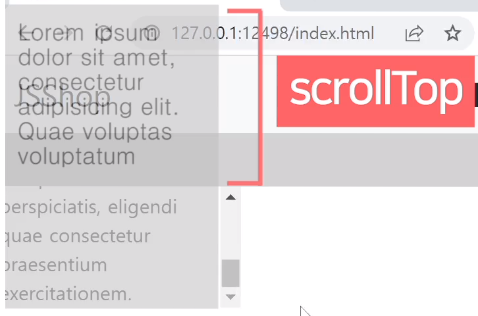

# 스크롤 이벤트

스크롤바 100px 내리면 로고 폰트사이즈 작게 만들기
---
> css 
```css
.navbar {
  position : fixed;
  width : 100%;
  z-index : 5
}
.navbar-brand {
  font-size : 30px;
  transition : all 1s;
}
```
- 상단메뉴는 상단고정, 로고 폰트사이즈를 키운 채로 시작

- 스크롤바를 100px 정도 내리면 폰트사이즈를 줄이려면

    - 스크롤바를 얼마나 내렸는지 알 수 있어야함

<br>

> javascript
```javascript
<script>
  $(window).on('scroll', function(){
    if (window.scrollY > 100) {
      $('.navbar-brand').css('font-size', '20px');
    }
  });
</script>
```

<br>

---

<br>

스크롤 이벤트리스너 
---
> javascript
```javascript
window.addEventListener('scroll', function(){
  console.log('안녕')
});
```
- 스크롤바를 조작하면 scroll 이벤트 발생

- scroll 이벤트리스너를 전체 페이지에 달면

    - 전체 페이지를 스크롤할 때마다 원하는 코드 실행 가능

- 스크롤바 만질 때 마다 `안녕` 출력
 
<br>

### 💡 window : 전체 페이지를 의미
- document도 전체 페이지

- window가 약간 더 큰 개념

    - scroll 이벤트리스너는 관습적으로 window에 붙임 

<Br>

---

<br>
 

스크롤 관련 유용한 기능들
---
- 스크롤 이벤트리스너안에서 쓰는 유용한 기능들 

<br>

> javascript
```javascript
window.addEventListener('scroll', function(){
  console.log( window.scrollY )
});
```
- window.scrollY : 현재 페이지를 얼마나 위에서부터 스크롤했는지 px 단위로 알려줌

- window.scrollX : 가로로 얼마나 스크롤했는지 알려줌

    - 가로 스크롤바가 있으면

 
<br>

> javascript
```javascript
window.scrollTo(0, 100)
```
- window.scrollTo(x, y) : 강제로 스크롤바를 움직일 수 있음

    - 위에서부터 100px 위치로 스크롤

<br>

> javascript
```javascript
window.scrollBy(0, 100)
```
- window.scrollBy(x, y) : 현재 위치에서부터 스크롤

    - 현재 위치에서부터 +100px 만큼 스크롤

    - 실행하면 스크롤 위치가 순간이동
    
        - bootstrap을 설치했을 경우 천천히 이동

        - :root { scroll-behavior : auto } css 파일 맨 위에 추가하면 순간이동

 
<br>

> javascript
```javascript
$(window).on('scroll', function(){
  $(window).scrollTop();
})
```
- jQuery 버전

    - $(window).scrollTop() : 현재 페이지 스크롤 양 알려줌

    - $(window).scrollTop(100) : 페이지 강제이동

<br>

---

<br>

 

박스 끝까지 스크롤시 알림띄우기
---
> html
```html
<div class="lorem" style="width: 200px; height: 100px; overflow-y: scroll">
  Lorem ipsum dolor sit amet, consectetur adipisicing elit. Quae voluptas voluptatum minus praesentium fugit debitis at, laborum ipsa itaque placeat sit, excepturi eius. Nostrum perspiciatis, eligendi quae consectetur praesentium exercitationem.
</div> 
```
- 박스를 끝까지 스크롤하면 alert() 띄우기

    - div 스크롤바 내린 양 == div 실제높이일 경우 alert 띄우기

<br>

---

<br>

div 박스의 스크롤바 내린 양
---
- 박스를 셀렉터로 찾고 .scrollTop 

    - 스크롤바를 위에서부터 얼마나 내렸는지 알려줌

<br>

> javascript
```javascript
$('.lorem').on('scroll', function(){
  var 스크롤양 = document.querySelector('.lorem').scrollTop;
  console.log(스크롤양);
});
```
- 현재 페이지 스크롤양도 .scrollTop으로 구할 수 있음

    - html 태그 찾아서 .scrollTop 


<br>

---

<br>

div 박스 높이 구하는 법 
---
- 스크롤바가 생긴 박스의 경우 실제 높이가 궁금할 때

    - 박스에 스타일로 넣은 height : 100px 말고 스크롤가능한 실제높이

    - 셀렉터로 찾아서 .scrollHeight 

<br>

> javascript
```javascript
$('.lorem').on('scroll', function(){
  var 스크롤양 = document.querySelector('.lorem').scrollTop;
  var 실제높이 = document.querySelector('.lorem').scrollHeight;
  console.log(스크롤양, 실제높이);
});
```
- 박스가 화면에 보이는 부분 높이 : .clientHeight

    - document.querySelector('.lorem').scrollHeight;

 
<br>

---

<br>

div 스크롤바 내린 양 == div 실제높이일 경우 alert 띄우기
---

- 스크롤바를 끝까지 내려도

    - 스크롤바 내린 양은 188.x

    - div 실제높이는 288

<br>

|-|
|-|
||

- 스크롤바 내린 양은 진짜 스크롤바 내린 양일 뿐

    - 박스가 보이는 높이는 포함 X

- div 스크롤바 내린 양 + div가 화면에 보이는 높이 == div 실제높이일 경우 alert 띄워는 것으로 변경

    - 스크롤 내린 양은 정수단위로 나오지 않고 OS 마다 부정확
    
        - 여유를 두고 비교하는게 좋음

    - 끝까지 스크롤했는지 체크하는 것 보다 끝에서 10px 정도 남기고 스크롤했는지 체크

<br>

> javascript
```javascript
$('.lorem').on('scroll', function(){
  var 스크롤양 = document.querySelector('.lorem').scrollTop;
  var 실제높이 = document.querySelector('.lorem').scrollHeight;
  var 높이 = document.querySelector('.lorem').clientHeight;
  if (스크롤양 + 높이 > 실제높이 - 10) {
    alert('다읽음')
  }
});
```

 
<br>

---

<br>

스크롤 다룰 때 주의점
---
- 스크롤이벤트리스너 안의 코드는 1초에 60번 이상 실행

  - 스크롤 이벤트리스너는 많이 달면 성능저하 발생 
  
    - 스크롤바 1개마다 1개만 사용 권장

- 스크롤이벤트리스너 안의 코드는 1초에 여러번 실행

  - 바닥체크하는 코드도 여러번 실행될 수 있음

    - 위 코드에서 alert가 2번 뜰 수 있다는 뜻

  - 변수 활용하면 방지 가능

 
<br>

---

<br>

현재 페이지를 끝까지 스크롤했는지 체크하려면?
---
- 현재페이지를 찾아서 .scrollTop .scrollHeight .clientHeight 붙이이기

<br>

> 현재페이지를 찾으려면 
```javascript
document.querySelector('html').scrollTop;  //현재 웹페이지 스크롤양
document.querySelector('html').scrollHeight; //현재 웹페이지 실제높이
document.querySelector('html').clientHeight; //현재 웹페이지 보이는 높이임
```
- html 태그 찾으면 됨

  - .scrollTop : 너무 길면 window.scrollY 써도 OK

<br>
 
### 💡 주의
- 웹페이지 scrollHeight 구할 때

  -  브라우저마다 약간의 오차가있을 수 있어서 테스트 필수

- 웹페이지 scrollHeight 구하는 코드는 페이지 로드가 완료되고나서 실행해야 정확

  - \<body> 끝나기 전에 작성

 
<br>

---

<br>

정리
---
- 스크롤바 조작할 때 마다 코드 실행 가능

- 박스의 숨겨진 실제 높이 구할 수 있음

- 스크롤내린 양 구할 수 있음

- 문법은 필요할 때 찾아 사용

<br>

---

<br>

응용
---
- 페이지 내릴 때 마다 페이지를 얼마나 읽었는지 진척도를 알려주는 UI

  - 유색의 가로로 긴 div 박스 하나 생성

  - 페이지를 1% 읽으면 div 박스 길이는 1%

  - 페이지를 50%정도 읽으면 div 박스 길이는 50% 

  - 페이지 다 읽으면 div 박스 길이는 100% 

<br>
