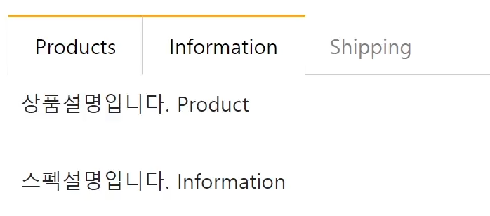
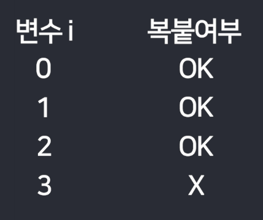
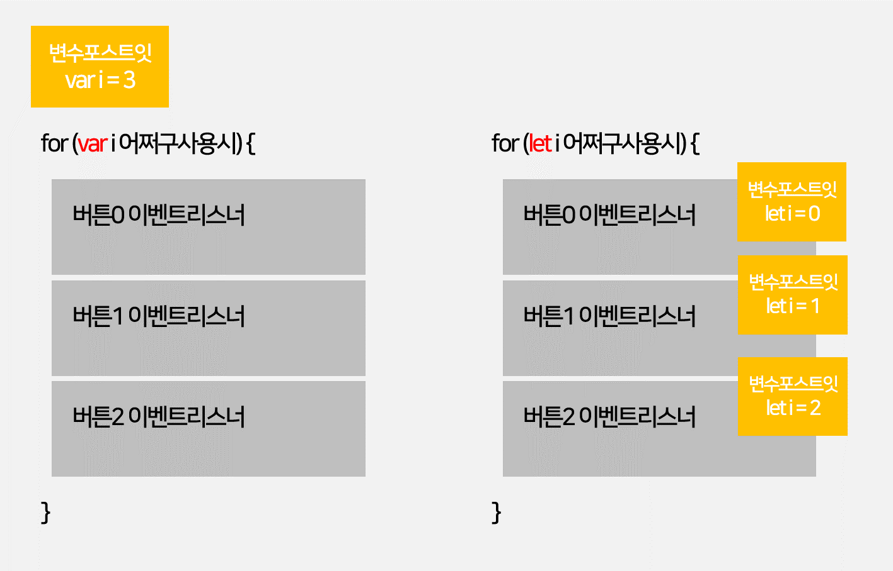

# 탭기능과 for 반복문

탭
---

|-|
|-|
||

- 탭 : 이렇게 생긴 UI

    - 버튼3개, div 박스 3개 생성

    - 버튼누르면 거기 맞는 div박스를 보여주기

<br>

> detail.html
```html
<style>
  ul.list {
    list-style-type: none;
    margin: 0;
    padding: 0;
    border-bottom: 1px solid #ccc;
  }
  ul.list::after {
    content: '';
    display: block;
    clear: both;
  }
  .tab-button {
    display: block;
    padding: 10px 20px 10px 20px;
    float: left;
    margin-right: -1px;
    margin-bottom: -1px;
    color: grey;
    text-decoration: none;
    cursor: pointer;
  }
  .orange {
    border-top: 2px solid orange;
    border-right: 1px solid #ccc;
    border-bottom: 1px solid white;
    border-left: 1px solid #ccc;
    color: black;
    margin-top: -2px;
  }
  .tab-content {
    display: none;
    padding: 10px;
  }
  .show {
    display: block;
  }
</style>

<div class="container mt-5">
  <ul class="list">
    <li class="tab-button">Products</li>
    <li class="tab-button orange">Information</li>
    <li class="tab-button">Shipping</li>
  </ul>
  <div class="tab-content">
    <p>상품설명입니다. Product</p>
  </div>
  <div class="tab-content show">
    <p>스펙설명입니다. Information</p>
  </div>
  <div class="tab-content">
    <p>배송정보입니다. Shipping</p>
  </div>
</div> 
```
- \<li> 태그로 버튼 3개 생성

- \<div> 태그로 박스 3개 생성

- orange 클래스명을 추가하면 버튼누른듯한 효과

- show 클래스명을 추가하면 박스를 보여줄 수 있음

 
<br>

---

<br>

자바스크립트 파일 모듈화하는 법
---
- 자바스크립트 코드가 너무 길고 복잡하면 다른 파일로 뺄 수 있음

    - 작업폴더에다가 파일명.js 생성 후 코드 작성 

    - 그 코드가 필요한 html 파일에 연결

<br>

> html
```html
<script src="경로/파일명.js"></script>
```

<br>

첫 버튼부터 기능개발
---
- 우선 첫 버튼만 기능 개발

- 탭의 0번 버튼 누르면

    - 버튼0에 orange 클래스명 부착

    - 박스0에 show 클래스명 부착


<br>

|-|
|-|
||
|▲ 버튼0 눌렀을 때 보이는 화면|

<br>

- 기존에 붙어있던 orange, show 클래스 제거 필요

- 버튼0 누르면

    - 버튼0,1,2에 붙어있던 orange 클래스명 전부 제거하라고 코드 3줄 짜기

    - 버튼0에 orange 클래스명 부착

    - 박스0,1,2에 붙어있던 show 클래스명 전부 제거하라고 코드 3줄 짜기

    - 박스0에 show 클래스명 부착

<br>


### 💡 참고
- 버튼0,1,2에 붙어있던 orange 클래스명 전부 제거하라고 코드 3줄이나 작성하는 이유

    - 무슨 버튼에 orange가 들어있을지 모름

    - 3개 버튼에 있는거 전부 제거하라고 코드짜면 간단

<br>

---

<br>

jQuery 셀렉터로 여러 요소 찾은 뒤 하나만 고르기
---
- class="tab-button" 가진 요소가 3개 존재

    - $('.tab-button').on() 이벤트리스너 달면 3개 버튼에 전부 이벤트리스너 달림

<br>

> 버튼0만 달고 싶으면 
```javascript
$('.tab-button').eq(0).on('click', function(){
  
});
```
- $( ) 셀렉터로 찾은 요소 중에 x번째 요소만 선택

    - $( ).eq(x)

- querySelectorAll() 쓰는 경우에도 [0] 등 인덱스 붙여야 함


<br>

---

<br>

탭기능 완성
---
- 버튼0 누르면

  1. 버튼0,1,2에 붙어있던 orange 클래스명 전부 제거하라고 코드 3줄 짜기

  2. 버튼0에 orange 클래스명 부착

  3. 박스0,1,2에 붙어있던 show 클래스명 전부 제거하라고 코드 3줄 짜기

  4. 박스0에 show 클래스명 부착

```js
$('.tab-button').eq(0).on('click', function(){
  $('.tab-button').removeClass('orange');
  $('.tab-button').eq(0).addClass('orange');
  $('.tab-content').removeClass('show');
  $('.tab-content').eq(0).addClass('show');
})

$('.tab-button').eq(1).on('click', function(){
  $('.tab-button').removeClass('orange');
  $('.tab-button').eq(1).addClass('orange');
  $('.tab-content').removeClass('show');
  $('.tab-content').eq(1).addClass('show');
});


$('.tab-button').eq(2).on('click', function(){
  $('.tab-button').removeClass('orange');
  $('.tab-button').eq(2).addClass('orange');
  $('.tab-content').removeClass('show');
  $('.tab-content').eq(2).addClass('show');
});
```
- querySelectorAll() 쓰면 뒤에 [0] 인덱스 써야함

 
<br>

---

<br>

좋은 관습 : 반복적인 셀렉터는 변수에 넣어서 쓰기
---
- 비슷한 셀렉터가 매우 많이 등장할 경우 변수에 넣어 쓰기

- 셀렉터 문법은 기본적으로 작동시간이 오래걸림

  - 셀렉터 하나 쓸 때 마다 html을 쭉 읽고 찾아야해서 오래걸리는 것

  - html이 길고 복잡할 수록 더 오래걸림

- querySelector 도 마찬가지

<br>

```js
var 버튼 = $('.tab-button');

버튼.eq(0).on('click', function(){
  버튼.removeClass('orange');
  버튼.eq(0).addClass('orange');
  $('.tab-content').removeClass('show');
  $('.tab-content').eq(0).addClass('show');
})
```
- 셀렉터 3번 쓰던걸 1번으로 줄일 수 있어서 성능적 이점 발생 

<br>

코드 복붙하고 싶으면 for 반복문
---
- 탭기능에서 비슷한 코드덩어리 6줄이 3번이나 반복

- 비슷한 코드는 for 반복문 사용시 쉽게 복붙 가능 

<br>

> 문법
```js
for (횟수){
  복붙할 코드
}
```
- 복붙이라기보다는 반복실행

<br>

> 횟수넣는 부분
```js
for (var i = 0; i < 3; i++) {
  console.log('안녕')
}
```
- console.log('안녕') 3번 복사 붙여넣기 됨

  - i를 0부터 시작해서 / i < 3 까지 / i에 1씩 더해가면서 복붙

<br>

|-|
|-|
||

<br>

> ex
```js
for (var i = 0; i < 3; i++) {
  console.log(i)
}
```
- 출력 결과 : `0, 1, 2`

  - i가 3이 될 때 반복문 중지 

<br>

> ex
```js
for (var i = 0; i < 5; i++) {
  console.log('안녕')
}
```
- 출력 결과 : `안녕` 5번 출력

<br> 

> ex
```js
for (var i = 3; i < 6; i++) {
  console.log('안녕')
}
```
- 출력 결과 : `안녕` 3번 출력

<br>

---

<br>

for 반복문으로 탭기능 코드 줄이기
---
- 코드가 너무 길거나 중복이면 for 사용

> 탭기능
```js
$('.tab-button').eq(0).on('click', function(){
  $('.tab-button').removeClass('orange');
  $('.tab-button').eq(0).addClass('orange');
  $('.tab-content').removeClass('show');
  $('.tab-content').eq(0).addClass('show');
})
```
- 이 덩어리가 3번이 반복

  - 반복될 때 마다 0 부분이 1과 2로 바뀜

<br>
 
> 반복문 변환
```js
for (var i = 0; i < 3; i++){

  $('.tab-button').eq(0).on('click', function(){
    $('.tab-button').removeClass('orange');
    $('.tab-button').eq(0).addClass('orange');
    $('.tab-content').removeClass('show');
    $('.tab-content').eq(0).addClass('show');
  })
});
```
- 안에 있던 코드 3번 반복

- 반복할 때마다 0부분을 1로 바꾸고 2로 바꿔야 함

  - 0 대신 반복문이 진행되며 0, 1, 2로 차례로 바뀌는 변수 넣음

<br>

> 탭기능 수정
```js
for (var i = 0; i < 3; i++){

  $('.tab-button').eq(i).on('click', function(){
    $('.tab-button').removeClass('orange');
    $('.tab-button').eq(i).addClass('orange');
    $('.tab-content').removeClass('show');
    $('.tab-content').eq(i).addClass('show');
  })
});
```
- 동작 X

  - for 반복문 사용할 때 변수를 var i 말고 let i로 바꿔야 잘 작동

<br>

> 탭기능 완성
```js
for (let i = 0; i < 3; i++){

  $('.tab-button').eq(i).on('click', function(){
    $('.tab-button').removeClass('orange');
    $('.tab-button').eq(i).addClass('orange');
    $('.tab-content').removeClass('show');
    $('.tab-content').eq(i).addClass('show');
  })
});
```
<br>


### var 쓰면 안되고 let 쓰면 잘되는 이유 
> var
```js
for (var i = 0; i < 3; i++){

  $('.tab-button').eq(i).on('click', function(){
    $('.tab-button').removeClass('orange');
    $('.tab-button').eq(i).addClass('orange');
    $('.tab-content').removeClass('show');
    $('.tab-content').eq(i).addClass('show');
  })
});
```
- 컴퓨터의 입장이 되어서 위 코드를 읽으면 이해 가능

  - (1) 컴퓨터는 위에서부터 한줄한줄 코드를 해석

  - (2) for 반복문을 발견해서 안에 있는 코드를 반복실행하려고 함

  - (3) 이벤트리스너 마주침
  
    -  이벤트리스너 안의 코드는 바로 실행 X
    
      - 사용자가 버튼을 클릭시 실행되는 코드   

    - 이벤트리스너 내의 4줄 코드는 실행하지 않고 지나감

      - 반복문 안의 코드를 3번 실행

  - (4) 반복문 끝나서 var i 변수는 3이 되어있음 

  - (5) 반복문이 다 돌고난 후 한참 후에, 사용자가 버튼0을 클릭
  
    - 컴퓨터는 이벤트리스너 안의 코드 4줄을 실행

  - (6) i 라는 변수를 발견

  - (7) $('.tab-button').eq(3) 없음 

    - 4번 버튼은 없음

  - (8) 에러 발생

<br>

> (6) 추가 설명
```js
$('.tab-button').eq(i).addClass('orange');
$('.tab-content').eq(i).addClass('show');
```
- 컴퓨터는 변수를 발견하면 근처에서 변수를 찾아서 채우려는 습성이 있음

- 반복문을 다 돌고난 var i라는 변수가 3이 되어있는걸 찾아내 사용

  - 반복문이 다 돌고난 후라서 var i 변수는 3이 되어 남아있음

<br>

> let
```js
for (let i = 0; i < 3; i++){

  $('.tab-button').eq(i).on('click', function(){
    $('.tab-button').removeClass('orange');
    $('.tab-button').eq(i).addClass('orange');
    $('.tab-content').removeClass('show');
    $('.tab-content').eq(i).addClass('show');
  })
});
```
- let 변수를 사용하면 변수포스트잇이 for 바깥이 아니라 안쪽에 생성

<br>

|var VS let|
|-|
||

- for 안에서 var i = 0 쓰면

  - var 변수는 범위가 function

  - var i 들어있는 포스트잇은 for 바깥에 생성

- for 안에서 let i = 0 쓰면

  - let 변수는 범위가 { }

  - let i 들어있는 포스트잇은 for 안쪽에 3개 생성

- 컴퓨터는 변수가져다쓸 때 가까운거 가져다 쓰려고함

<br>

---

<br>
 

확장성있는 코드로 바꾸기
---
- 좋은 코드 체크 기준

  1. 원하는 기능이 잘 구현되었는가

  2. 확장성좋은가

  3. 나중에 관리가 쉬울 것인가

  4. 성능문제 없는가

<br>

- 탭이 3개면 잘 동작하지만 4개 5개가 되면 잘 동작하지 않음

  - 탭이 4개나 5개로 바뀌어도 잘 동작하는 코드가 되려면?

- 현재 반복문에 3이라고 하드코딩해놔서 무조건 3번 코드 반복

  - 탭이 몇개든 간에 앞의 3개만 잘 동작 

    - 3이라는 숫자 대신 `지금 html에 있는 탭 버튼의 갯수` 넣기`

<br>

> 정답
```js
for (let i = 0; i < $('.tab-button').length; i++){

  $('.tab-button').eq(i).on('click', function(){
    $('.tab-button').removeClass('orange');
    $('.tab-button').eq(i).addClass('orange');
    $('.tab-content').removeClass('show');
    $('.tab-content').eq(i).addClass('show');
  })
});
```
- 여러개 찾아주는 셀렉터로 html 요소 찾은 다음에 .length 붙이면 갯수 세어줌

<br>

