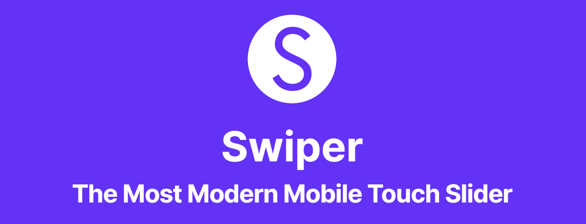
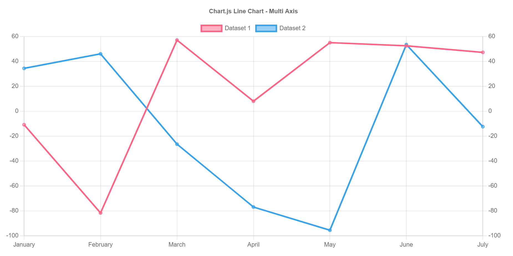
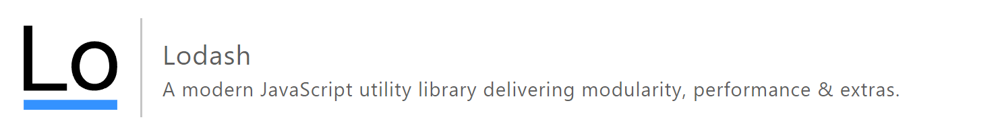

# 자바스크립트 라이브러리들

- 직접 자바스크립트 코드를 처음부터 짜기 싫다면

    - 남들이 만들어놓은 라이브러리 사용

- UI 개발도 마찬가지로 복사 붙여넣기식으로 UI 개발이 가능

<br>

---

<br>

Swiper
---

|Swiper|
|-|
||

- 캐러셀 (이미지슬라이드) 만들고 싶으면 

    - 직접 코드 작성

    - 예쁘고 쉽게 여러기능을 만들고 싶으면 Swiper 라이브러리 사용

        - 호환 잘되고 이미지 lazy loading, 터치/드래그 가능
 
- 설치 방법

    - [방문](https://swiperjs.com/get-started#use-swiper-from-cdn)해서 튜토리얼 그대로 js 파일, css 파일 다운받아 첨부

- html css js 예제코드 복붙하면 캐러셀 구현됨

- 사용법도 홈페이지 참고

<br>

> 예제코드
```html
<!DOCTYPE html>
<html>
  <head>
    <meta charset="utf-8">
    <title>Swiper demo</title>
    <meta name="viewport" content="width=device-width, initial-scale=1, minimum-scale=1, maximum-scale=1">
    <!-- Link Swiper's CSS -->
    <link rel="stylesheet" href="https://unpkg.com/swiper/swiper-bundle.min.css">
    <style>
      .mySwiper {
        width: 100%;
        height: 300px;
      }
      .swiper-slide {
        display: flex;
        justify-content: center;
        align-items: center;
      }
    </style>
  </head>

  <body>
    <div class="swiper mySwiper">
      <div class="swiper-wrapper">
        <div class="swiper-slide">Slide 1</div>
        <div class="swiper-slide">Slide 2</div>
        <div class="swiper-slide">Slide 3</div>
      </div>
      <div class="swiper-button-next"></div>
      <div class="swiper-button-prev"></div>
    </div>

    <script src="https://unpkg.com/swiper/swiper-bundle.min.js"></script>
    <script>
      var swiper = new Swiper(".mySwiper", {
        navigation: {
          nextEl: ".swiper-button-next",
          prevEl: ".swiper-button-prev"
        }
      });
    </script>

  </body>
</html>
```
 
<br>

---

<Br>

Chart.js 
---

|Chart.js|
|-|
||

- 웹페이지에 차트만들고 싶으면 사용

- 관리자, admin 페이지 만들 때 통계 보여주기 유용

- 코인거래소 같은 곳에는 더 프로페셔널한 유료 차트라이브러리 쓰기도 함

- 설치 방법

    - [방문](https://cdnjs.com/libraries/Chart.js)해서 js 파일 다운
    
    - cdn 버전으로 구해서 html 파일에 연결

- [Chart.js 홈페이지 예제 코드](https://www.chartjs.org/docs/latest/) 아무데나 붙여넣기 하면 차트 구현됨

 
<br>

---

<br>

Animate On Scroll
---
- 스크롤 내리면 요소가 서서히 등장하는 애니메이션을 만들고 싶을 때 사용

- 설치 방법

    - [방문](https://github.com/michalsnik/aos)해서  css파일, js 파일 cdn버전 찾아서 html 파일에 연결

    - 밑에 \<script> 태그 열어서 코드 작성

> 설치 방법
```js
<script>
  AOS.init();
</script>
```

- [방문](https://michalsnik.github.io/aos/)해서 예제 코드 복붙하면 구현됨

    - \<div data-aos="fade-up"></div>

    - 원하는 박스에 위 형식으로 추가

        - 시간, 방향 설정, 원하는 클래스명 부착 가능 

<br>

---

<br>

EmailJS
---

|EmailJS|
|-|
||

- 원래 이메일 전송은 서버가 해야하지만 Gmail 등 서버를 잠깐 빌리면 자바스크립트만으로 이메일 전송 가능

    - 유저가 내 이메일 계정으로 이메일 전송도 가능

    - 내 이메일 계정으로 남에게 이메일 전송도 가능

- [방문](https://www.emailjs.com/docs/introduction/how-does-emailjs-work/)해서 가입하고 계정만들기

    - 튜토리얼 복붙하고 EmailJS 계정아이디 채우면 완료 

 
<br>

---

<br>

Lodash
---
|Lodash|
|-|
||

- array, object, 문자, 숫자 자료를 다루기 편해지는 기본함수들 제공

- ex) array 자료에 있는 'a' 문자를 제거하려면

    - 직접 반복문 작성
    
    - filter 함수 사용

    - Lodash 설치해놨으면 _.pull(어레이자료, 'a'); 사용

- [설치파일](https://lodash.com/)(4kb)

<br>

---

<Br>

React or Vue 
---
- 특정 앱 개발시 유용한 자바스크립트 라이브러리

    - 페이지가 너무 많아서 UI 재활용이 자주 필요한 사이트

    - 모바일 앱처럼 페이지 이동없이 동작하는 Single Page Application

- 요즘은 원래 용도와 관계없이 사용음

<br>

---

<br>

Fullpage.js
---

|Fullpage.js|
|-|
||

- 웹페이지를 PPT처럼 만들어줌

- 버튼누르면 다음 슬라이드 보여줌 

    - 이런 UI는 유행 지남

    - 상업적 이용은 유료

- [동작예시](https://alvarotrigo.com/fullPage/)

- 설치 방법

    - [방문](https://github.com/alvarotrigo/fullPage.js/tree/master/lang/korean#fullpagejs)해서 css, js 파일을 cdn 식으로 설치

    - 예시 html과 js 코드 복붙하면 완성 

<br>
 