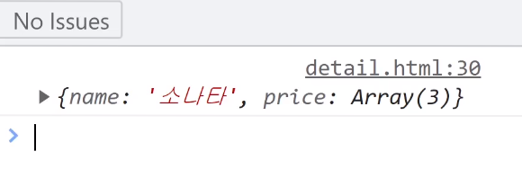
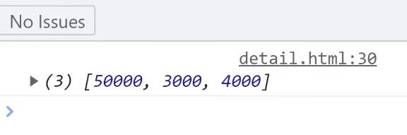

# Array & Object 데이터바인딩

복잡한 자료를 다루기
---

> 복잡한 자료
```html
<div class="container mt-3">
  <div class="card p-3">
    <span class="car-title">상품명</span>
    <span>가격</span>
  </div>
</div> 

<script>
  var car2 = { name : '소나타', price : [50000, 3000, 4000] } 
  document.querySelector('.car-title').innerHTML = car2.name;
</script>
```
- car2 에 저장된 자료 array 형으로 변경

    - object 안에 array/object 넣기 가능

    - array 안에 array/object 넣기 가능

<br>

---

<br>
 
복잡한 데이터에서 자료꺼내기
---
- console.log 사용해 복잡한 자료 출력하여 확인

- 콘솔창에선 복잡한 자료도 어떻게 생겼는지 쉽게 축약해서 알려줌

    - 시작기호 체크

<br>

|-|
|-|
||

- console.log(car2)

    - 시작기호가 `{` : object 자료형
    
- object 자료에서 자료꺼내는 문법 작성

 
<br>

|-|
|-|
||

- console.log(car2.price) 

    - 시작기호가 `[` : array 자료형

- array 자료에서 자료꺼내는 문법 작성
 
    - console.log(car2.price[1]) : `3000` 출력 

    - console.log(car2.price[0]) : `50000` 출력

이렇게 하나하나 데이터 뽑아가면 아무리 어려운 것도 잘 뽑을 수 있음 

<br>

사용 이유
--- 
- html에 하드코딩해놓으면 안되는 이유

    - 실제 사이트는 html이 계속 바뀜

- ex. 쇼핑몰 : 가격 계속 변동

    - 가격을 서버에서 받아와서 html로 보여줘야함 

    - html 안에 하드코딩하면 수정 힘듦

        - 위 문제점 방지를 위해 `서버에서 받아온 데이터를 넣어달라`고 코드 작성

 
<br>

---

<br>

웹서비스 개발 방식
---
- 웹서비스

    - 누가 내 사이트로 접속하면 html 이쁘게 만들어서 보내주는 것 

- html을 누가 완성하는지에 따라 개발방식의 차이 有

<br>

### 1. 서버에서 html을 미리 완성해서 고객에게 보내줌 

|server-side rendering|
|-|
||

<br> 

### 2. 서버가 비어있는 html과 데이터만 보내줌 
- 자바스크립트를 이용해서 고객 브라우저안에서 html을 완성

|client-side rendering|
|-|
||


<br>
 

- 데이터바인딩하는 문법이 너무 길고 복잡하기 때문에 작은 사이트는 자바스크립트 써도 커버가능

- 큰거 만들 땐 라이브러리 설치해 사용

    - jQuery, React, Vue 사용하면 코드가 짧아짐

<br>

---

<br>
 

3개의 상품 제목, 가격을 html에 넣기
---
- products 변수안에 상품데이터도 준비되어있음

<br>

> list.html
```html
<div class="card-group container">
  <div class="card">
    
    <div class="card-body">
      <h5>Card title</h5>
      <p>가격 : 70000</p>
      <button class="btn btn-danger">주문하기</button>
    </div>
  </div>
  <div class="card">
    
    <div class="card-body">
      <h5>Card title</h5>
      <p>가격 : 70000</p>
      <button class="btn btn-danger">주문하기</button>
    </div>
  </div>
  <div class="card">
    
    <div class="card-body">
      <h5>Card title</h5>
      <p>가격 : 70000</p>
      <button class="btn btn-danger">주문하기</button>
    </div>
  </div>
</div>

<script>
  var products = [
    { id : 0, price : 70000, title : 'Blossom Dress' },
    { id : 1, price : 50000, title : 'Springfield Shirt' },
    { id : 2, price : 60000, title : 'Black Monastery' }
  ];
</script> 
```

<br>

> 첫째 상품명을 뽑기
```js
var products = [
  { id : 0, price : 70000, title : 'Blossom Dress' },
  { id : 1, price : 50000, title : 'Springfield Shirt' },
  { id : 2, price : 60000, title : 'Black Monastery' }
]; 
```
- 어렵게 생긴 자료도 console.log 해보면 쉽게 출력 가능

    - console.log(products) : `[{ }, { }, { }]` 

        - array 안에 object 3개가 들어있음

    - console.log(products[0]) : `{ id : 0, price : 70000, title : 'Blossom Dress' }`

- 원하는 자료를 뽑고 싶으면 시작 기호 체크

    - `[` : array ⇒ 인덱싱

    - `{` : object ⇒ 이름
 
- Blossom Dress 뽑으려면 `console.log(products[0].title)`


<br>

> products 변수 하단
```js
document.querySelectorAll('.card-body h5')[0].innerHTML = products[0].title;
document.querySelectorAll('.card-body p')[0].innerHTML = '가격 : ' + products[0].price

document.querySelectorAll('.card-body h5')[1].innerHTML = products[1].title;
document.querySelectorAll('.card-body p')[1].innerHTML = '가격 : ' + products[1].price;

document.querySelectorAll('.card-body h5')[2].innerHTML = products[2].title;
document.querySelectorAll('.card-body p')[2].innerHTML = '가격 : ' + products[2].price; 
```
- 카드에 상품명, 가격이 잘 들어감

    - 반복문 사용 가능

<br>

> 다른 방법
```js
<div class="card-group container">
    <div class="card">
    
    <div class="card-body" data-id="0">
        <h5>Card title</h5>
        <p>가격 : 70000</p>
        <button class="btn btn-danger">주문하기</button>
    </div>
    </div>
    <div class="card">
    
    <div class="card-body" data-id="1">
        <h5>Card title</h5>
        <p>가격 : 70000</p>
        <button class="btn btn-danger">주문하기</button>
    </div>
    </div>
    <div class="card">
    
    <div class="card-body" data-id="2">
        <h5>Card title</h5>
        <p>가격 : 70000</p>
        <button class="btn btn-danger">주문하기</button>
    </div>
    </div>
</div>

<script>
$('.card-body').each(function(){
    var dId = parseInt($(this).data('id')); // 현재 카드의 data-id 가져오기
    add($(this), dId);  // 해당 카드 업데이트
});

function add(id, num) {
    id.find('h5').html(products[num].title);    // 카드 제목 업데이트
    id.find('p').html(`가격 : ${products[num].price}`); // 카드 가격 업데이트
}
</script>
```
- dataset(data-id) 이용

<br>

---

<br>


문자 중간에 변수 넣기
---
> 문자 이어붙이기
```js
console.log(1 + '2');  // '12'출력됨
```
- 자바스크립트에서 덧셈기호 쓰면 문자 이어붙이기가 가능

    - 숫자 + 숫자 : 숫자 덧셈

    - 문자 + 숫자(적어도 1개가 문자) : 문자 덧셈

        - 문자덧셈 : 문자2개 이어붙여줌 

<br>

> 방법1
```js
var a = '안녕';
console.log('문자' + a + '문자');  // '문자안녕문자'출력됨
```
- 덧셈기호 활용

<br>

> 방법2
```js
var a = '안녕';
console.log(`문자 ${a} 문자`);  // '문자안녕문자'출력됨
```
- 키보드 물결기호 밑에 있는 백틱기호 사용

- 백틱기호도 문자만들어줌

    - 문자 중간에 엔터키 칠 수 있음

    - 중간에 ${ 변수명 } 문법을 이용가능

- ${ } : 문자안에 변수넣어주는 문법

    - 일반 따옴표안에선 사용불가능 

<br>