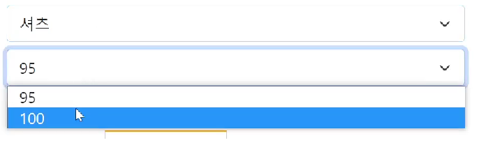

# Select 인풋 다루기

select 들어간 폼
---
> html 
```html
<form class="container my-5 form-group">
    <p>상품선택</p>
    <select class="form-select mt-2">
      <option>모자</option>
      <option>셔츠</option>
    </select>
</form>
```
- \<select> : 사용자가 고를 수 있는 선택지를 드랍다운 메뉴로 제공하는 \<input> 

- 선택지는 \<option>으로 넣음

- \<select> 태그도 선택시 input, change 이벤트 발생

- \<select> 태그도 .value로 유저가 입력한 값을 가져올 수 있음

<br>

---

<br>

셔츠고르면 밑에 \<select> 더 보여주기
---
 
|예시|
|-|
||

- 셔츠를 선택하면 하단에 95, 100 을 선택할 수 있는 \<select> 박스 구현

<br>

- 동적인 UI

    - html css로 미리 디자인해놓고 원할 때 보여주기

> html
```html
<form class="container my-5 form-group">
    <p>상품선택</p>
    <select class="form-select mt-2">
      <option>모자</option>
      <option>셔츠</option>
    </select>
    <select class="form-select mt-2 form-hide">
      <option>95</option>
      <option>100</option>
    </select>
</form>
```
- \<select> 하나 더 추가

    - form-hide 클래스에는 display : none 

- `유저가 셔츠선택하면 form-hide 제거해달라`고 코드 작성

<br>

> javascript
```js
<script>
  if (유저가 선택한거 == '셔츠') {
    $('.form-select').eq(1).removeClass('form-hide');
  }
</script>
```
- 유저가 \<select> 에서 뭐 선택했는지 알고 싶으면

    - \<input>과 똑같이 .value 사용 

<br>

> ex
```js
<script>
  var value = $('.form-select').eq(0).val();
  if (value == '셔츠') {
    $('.form-select').eq(1).removeClass('form-hide');
  }
</script>
```
- \<select> 찾아서 .value 붙이면 선택항목 출력

<br>

---

<br>

작동 X 이유
---
- \<script> 안에 적은 코드는 페이지 로드시 1회 실행됨

    - `유저가 셔츠선택하면 form-hide 제거해달라`고 코드 작성

        - 이 코드는 \<script> 안에 작성
        
            - 페이지 로드시 1회 실행되고 다시는 실행되지 않음

<br>

> \<select> 조작할 때 마다 실행하려면
```js
<script>
  $('.form-select').eq(0).on('input', function(){

    var value = $('.form-select').eq(0).val();
    if (value == '셔츠') {
      $('.form-select').eq(1).removeClass('form-hide');
    }

  });
</script>
```
- \<input>이나 \<select> 조작할 때 input 이벤트 발생

    - 이벤트리스너 부착

        - 정상 작동

<br>

---

<br>

응용
---

### 1. '모자'를 선택했을 때 \<select>를 다시 숨기는 기능

```js
<script>
    $('.form-select').eq(0).on('input', function(){
        console.log($('.form-select').eq(0).val());

        if($('.form-select').eq(0).val() == '셔츠') {
            $('.form-select').eq(1).removeClass('form-hide');
        }
        else if ($('.form-select').eq(0).val() == '모자') {
            $('.form-select').eq(1).addClass('form-hide');
        }
    });
</script>
```

<br>

### 2. 비슷한 셀렉터들 변수화하여 성능 개선

```js
<script>
    $('.form-select').eq(0).on('input', function(){
        console.log($('.form-select').eq(0).val());

        var firstSelectVal = $('.form-select').eq(0).val();
        var secondSelect = $('.form-select').eq(1);

        if(firstSelectVal == '셔츠') {
            secondSelect.removeClass('form-hide');
        }
        else if (firstSelectVal == '모자') {
            secondSelect.addClass('form-hide');
        }
    });
</script>
```

<br>

### 3. 이벤트리스너 안에서 e.currentTarget, this 사용

```js
<script>
    $('.form-select').eq(0).on('input', function(e){
        console.log(e.currentTarget.value);
        console.log(this.value);

        var secondSelect = $('.form-select').eq(1);

        if(e.currentTarget.value == '셔츠') {
            secondSelect.removeClass('form-hide');
        }
        else if (this.value == '모자') {
            secondSelect.addClass('form-hide');
        }
    });
</script>
```
 
<br>
 
---
 
<br>

# Select 자바스크립트로 html 생성

- 위에서 작성한 코드는 확장성 부족

  - 셔츠사이즈를 95, 100 이라고 하드코딩

- 실제 쇼핑몰이라면 셔츠 사이즈가 바뀔 것

  - 서버에서 보낸 데이터 갯수에 맞게 \<option> 태그 생성

<br>

---

<br>

html 생성하는 법 1
---
- \<div> 안에 \<p> 태그 생성

> html
```html
<div id="test">
  
</div>

<script>
  var a = document.createElement('p');
  a.innerHTML = '안녕';
  document.querySelector('#test').appendChild(a);
</script>
```
- 개발자도구 확인해보면 div 안에 p태그가 생성되어있음

- document.createElement() : html 자료 하나 생성

- 원하는대로 조작 후 appendChild() 사용시 html 생성

<br>

---

<br>

html 생성하는 법 2
---
 
> html
```html
<div id="test">
  
</div>

<script>
  var a = '<p>안녕</p>';
  document.querySelector('#test').insertAdjacentHTML('beforeend', a);
</script>
```
- 문자자료로 html 생성

- insertAdjacentHTML() 안에 넣기

- beforeend : 안쪽 맨 밑에 추가하라는 뜻

<br>

> html
```html
<div id="test">
  
</div>

<script>
  var a = '<p>안녕</p>';
  $('#test').append(a);
</script>
```
- append : 안쪽 맨 밑에 추가하라는 뜻

<br>

### 💡 안쪽에 추가하는게 아니라 아예 바꾸고 싶다면

- div찾아서 innerHTML = '\<p>\</p>'

  - jQuery에선 .html() 

<br>

---

<br>

바지옵션 누르면 다른 사이즈 나오게 하기
---
> html
```html
<form class="container my-5 form-group">
    <p>상품선택</p>
    <select class="form-select mt-2">
      <option>모자</option>
      <option>셔츠</option>
      <option>바지</option>
    </select>
    <select class="form-select mt-2 form-hide">
      <option>95</option>
      <option>100</option>
    </select>
</form>
```
- 첫 \<select> 에 바지옵션을 추가

  - 바지 누르면 28과 30 사이즈가 담긴 \<select>가 떠야함

- 코드 작성

  - html을 미리 만들어놨다가 보여주기

  - 매번 서버에서 데이터를 받아와서 `데이터 갯수만큼 \<option> 생성해달라`고 코드 작성 (☑️)

<br>

> javascript
```js
<script>
  $('.form-select').eq(0).on('input', function(){

    var value = $('.form-select').eq(0).val();
    if (value == '셔츠') {
      $('.form-select').eq(1).removeClass('form-hide');
    }
    else if (value == '바지'){
      $('.form-select').eq(1).removeClass('form-hide');
      $('.form-select').eq(1).html('');
      var 템플릿 = `<option>28</option><option>30</option>`;
      $('.form-select').eq(1).append(템플릿)
    }

  });
</script>
```
- 유저가 바지를 선택하면

  - 두번째 \<select> 보여주기

  - 두번째 \<select> 비우기

  - html 만들어서 두번째 \<select> 안에 append 


<br>

---

<br>

응용
---
- 바지 눌렀다가 다시 셔츠 누르면 이상해지는 문제 해결

  - 셔츠눌렀을 때 두번째 \<select> 안에 있는 html 조정

<br>

```js
<script>

    $('.form-select').eq(0).on('input', function(e){
        var firstSelectVal = $('.form-select').eq(0).val();
        var secondSelect = $('.form-select').eq(1);

        if(e.currentTarget.value == '셔츠') {
            var shirtsSize = `<option>95</option>
                <option>100</option>`;
            secondSelect.removeClass('form-hide');
            secondSelect.html(shirtsSize);
        }
        else if(this.value =='바지') {
            var pantsSize = `<option>28</option>
                <option>30</option>`;
            secondSelect.removeClass('form-hide');
            secondSelect.html(pantsSize);
        }
        else if (this.value == '모자') {
            $('.size').eq(0).addClass('form-hide');
        }
    });

</script>
```
 

<br>

---

<Br>

# Select  forEach, for in 반복문
- 서버에서 바지 사이즈 데이터 가져와서 그 갯수만큼 \<option> 생성

<br> 

> 기본 코드
```js
<script>
  var pants = [28, 30, 32];
  $('.form-select').eq(0).on('input', function(){

    var value = $('.form-select').eq(0).val();
    if (value == '셔츠') {
      $('.form-select').eq(1).removeClass('form-hide');
    }
    else if (value == '바지'){
      $('.form-select').eq(1).removeClass('form-hide');
      $('.form-select').eq(1).html('');
      여기다 무슨 코드 짜야함 
    }

  });
</script>
```
- 맨 위에 pants 라는 변수를 하나 만들고 서버에서 보낸데이터라고 가정

- pants 데이터 갯수만큼 \<option>을 생성하려면

  - 반복문 사용

<br>

> 반복문 추가
```js
<script>
  var pants = [28, 30, 32];
  $('.form-select').eq(0).on('input', function(){

    var value = $('.form-select').eq(0).val();
    if (value == '셔츠') {
      $('.form-select').eq(1).removeClass('form-hide');
    }
    else if (value == '바지'){
      $('.form-select').eq(1).removeClass('form-hide');
      $('.form-select').eq(1).html('');
      for (let i = 0; i < pants.length; i++){
        <option>생성해주세요~
      }
    }

  });
</script>
```
- pants.length 만큼 반복해달라고 요청

<br>

---

<br>

forEach 반복문 
---
- array 자료 뒤에 붙일 수 있는 forEach() 기본함수

  - 반복문

<br>

> javascript
```js
var pants = [28, 30, 32];
pants.forEach(function(){
  console.log('안녕')
});
```
- pants 안의 데이터 갯수만큼 forEach 콜백함수 안에 있는 코드 실행

  - 3번 실행

- array 자료 다룰 때 for 반복문 대신 forEach 사용 가능 

<br>

### 💡 콜백함수 넣는 이유

- 자바스크립트 forEach 만든 사람이 그렇게 쓰라고 함

 
<br>
 
> 콜백함수 안 파라미터
```js
var pants = [28, 30, 32];
pants.forEach(function(a, i){
  console.log(a)
});
```
- 콜백함수 안에 파라미터 2개까지 작명 가능

  - 첫번째 파라미터 : 반복문 돌 때 마다 array 안에 있던 하나하나의 데이터

  - 두번째 파라미터 : 반복문 돌 때 마다 0부터 1씩 증가하는 정수

<br>

> 코드 변경
```js
<script>
  var pants = [28, 30, 32];
  $('.form-select').eq(0).on('input', function(){

    var value = $('.form-select').eq(0).val();
    if (value == '셔츠') {
      $('.form-select').eq(1).removeClass('form-hide');
    }
    else if (value == '바지'){
      $('.form-select').eq(1).removeClass('form-hide');
      $('.form-select').eq(1).html('');
      pants.forEach(function(a){
        $('.form-select').eq(1).append(`<option>${a}</option>`)
      })
    }

  });
</script>
```
- pants 라는 서버에서 보낸 데이터가 바뀔 때 마다 \<option> 생성

  - 변화에 대응이 좋은 코드

<br>

---

<br>

응용
---
- var shirts = [95, 100, 105] 코드 추가

  - 셔츠 선택시 이 데이터 갯수만큼 \<option> 생성
 

```js
<script>

    var shirts = [95, 100, 105];
    var pants = [28, 30, 32, 34];

    $('.form-select').eq(0).on('input', function(e){
        console.log($('.form-select').eq(0).val());
        console.log(e.currentTarget.value);
        console.log(this.value);

        var firstSelectVal = $('.form-select').eq(0).val();
        var secondSelect = $('.form-select').eq(1);

        if(e.currentTarget.value == '셔츠') {
            secondSelect.removeClass('form-hide');
            secondSelect.html('')
            shirts.forEach(function(data){
                secondSelect.append(`<option>${data}</option>`);
            });
        }
        else if(this.value =='바지') {
            secondSelect.removeClass('form-hide');
            secondSelect.html('')
            pants.forEach(function(data){
                secondSelect.append(`<option>${data}</option>`);
            });
        }
        else if (this.value == '모자') {
            $('.size').eq(0).addClass('form-hide');
        }
    });

</script>
```

<br>

---

<br>
 

object 자료 다룰 때 for in 반복문 가능
---
- object 자료 갯수만큼 반복문을 돌리고 싶을 때 사용

> for in 반복문
```js
var obj = { name : 'kim', age : 20 }

for (var key in obj){
  console.log('안녕')
}
```
- 콘솔창에 `안녕` 2회 출력

- for in 반복문 쓰면 object 자료 안에 있는 key와 value를 다 출력 가능

- key 작명하는 부분은 반복문이 돌 때 마다 object자료 안에 있던 key값이 됨

<br>

> key 값 출력
```js
var obj = { name : 'kim', age : 20 }

for (var key in obj){
  console.log(key)
}
```
- 출력하면 `name, age`

- key 말고 실제 자료인 value를 출력하고 싶으면 

  - console.log(obj[key])

<br>

---

<br>

반복문의 용도
---
- 코드 복사붙여넣기용으로 쓰는게 for 반복문

- array나 object 자료 전부 꺼내서 쓰고 싶을 때도 반복문 쓰면 유용 

<br>

### 1. 코드 복붙하고 싶을 때 사용

<br>

### 2. array, object 자료 다 꺼내고 싶을 때 사용

<br>

---

<br>

arrow function 문법
---
- 함수 만드는 다른 문법

  - 콜백함수만들 때 자주 쓰는 방법

<br>

> 사용 방법
```js
var pants = [28, 30, 32];
pants.forEach(function(a){
  console.log(a)
});

pants.forEach((a) => {
  console.log(a)
});
```
- function 키워드 대신 => 화살표를 ( ) 우측에 부착

  - arrow function

<br>

> ex
```js
pants.forEach( a => {
  console.log(this)
});
```
- arrow function은 파라미터가 하나면 () 소괄호 생략 가능 

- 함수 중괄호 안에 return 한 줄 밖에 없으면 { } 중괄호와 return 동시 생략 가능

<br>

> 다른 방법
```js
let 함수 = function(){ console.log('안녕') }
let 함수 = () => { console.log('안녕') }
```
- arrow function이 가끔 보임

<br>

### 그냥 함수와 arrow function의 기능차이
- 함수 안에서 this를 써야할 경우 

  - 그냥 함수는 함수 안에서 this를 알맞게 재정의

  - arrow function은 함수 안에서 this를 재정의해주지 않고 바깥에 있던 this를 그대로 사용

    - 이벤트리스너 콜백함수안에서 this를 써야할 때 arrow function 쓰면 의도와 다르게 동작

<br>