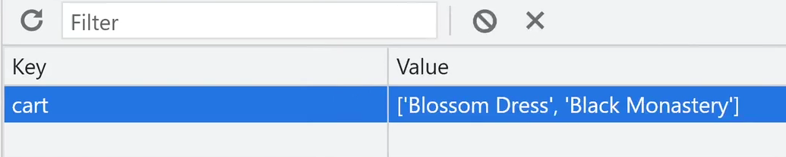

# localStorage

브라우저 저장공간
---
- 크롬 개발자도구의 Application 탭에서 확인 가능

    - Local Storage / Session Storage (key : value 형태로 문자, 숫자 데이터 저장가능)

    - Indexed DB (크고 많은 구조화된 데이터를 DB처럼 저장가능, 문법더러움)

    - Cookies (유저 로그인정보 저장공간)

    - Cache Storage (html css js img 파일 저장해두는 공간)

<br>

---

<br>
 

Local Storage / Session Storage
---
- 문자, 숫자만 key : value 형태로 저장가능

- 5MB까지만 저장가능

- Local Storage는 브라우저 재접속해도 영구적으로 남아있음

    - 유저가 브라우저 청소하지 않는 이상 반영구적으로 데이터저장 가능 

- Session Storage는 브라우저 끄면 날아감 

<br>

---

<br>

로컬스토리지 사용법
---
> 사용법
```javascript
localStorage.setItem('이름', 'kim') //자료저장하는법
localStorage.getItem('이름') //자료꺼내는법
localStorage.removeItem('이름') //자료삭제하는법
```
- 수정하려면 꺼내서 수정하고 다시 저장

- 문자나 숫자만 저장 가능

- sessionStorage.~로 바꾸면 Session Storage에 저장 가능

<br>

---

<br>

로컬스토리지에 array/object 저장
---
- array/object를 로컬스토리지에 저장하면 강제로 문자로 바꿔서 저장

    - 자료가 깨짐

- array/object를 JSON으로 바꾸면 문자취급을 받아 안전하게 로컬스토리지에 저장 가능

    - JSON : 따옴표친 array/object

- array/object → JSON 변환하고 싶으면 JSON.stringify()

- JSON → array/object 변환하고 싶으면 JSON.parse()


<br>

> 사용법
```js
var arr = [1,2,3];
var newArr = JSON.stringify(arr);

localStorage.setItem('num', newArr)
```
1. JSON.stringify() 안에 array/object 집어넣으면 JSON으로 변경

2. localStorage에 저장하라고 코드 작성

<br>
 
> JSON → array/object
```js
var arr = [1,2,3];
var newArr = JSON.stringify(arr);

localStorage.setItem('num', newArr);

//꺼내서 쓸 땐
var 꺼낸거 = localStorage.getItem('num');
꺼낸거 = JSON.parse(꺼낸거);
console.log(꺼낸거);
```
- JSON으로 저장했으니 꺼내도 JSON

- 다시 array/object로 바꾸고 싶으면 

    - JSON.parse() 안에 넣기

<br>

---

<Br>

응용
---
### 1. 카드하단 구매버튼추가하고 그거 누르면 누른 상품의 이름을 localStorage에 저장하기
- 구매 누를 때 마다 array에 항목 추가

|-|
|-|
||
|▲ array 안에 전부 저장|

- localStorage가 비어있을 때는 array를 추가

- localStorage에 이미 뭐가 있을 때는 array를 수정

> javascript
```js
products.forEach(function(a, i){
  (생략)
  <h5>${products[i].title}</h5>
  <p>가격 : ${products[i].price}</p>
  <button class="buy">구매</button>
});

$('.buy').click(function(){
  var title = $(e.target).siblings('h5').text();
  if (localStorage.getItem('cart') != null ){
    var 꺼낸거 = JSON.parse(localStorage.cart);
    꺼낸거.push(title);
    localStorage.setItem('cart', JSON.stringify(꺼낸거));
  } else {
    localStorage.setItem('cart', JSON.stringify([title]))
  }
});
```
- 카드레이아웃 생성하는 코드에 \<button class="buy">구매</button> 추가

    - 이 버튼 누르면 버튼 위에 있던 상품제목을 가져와서 array형식으로 저장
 
- 구매버튼에 이벤트리스너 부착

    - jQuery함수인 .siblings() : 내 형제요소를 찾아줌 
    
        - 형제요소 : 나랑 나란히 배치된 html 태그들

    - 쌩자바스크립트 : e.target.previousElementSibling.previousElementSibling

- 로컬스토리지에 저장

    - 구매버튼 누를 때 마다 array가 새로 생성만 되고 추가는 안됨

    - `이미 뭐가 저장되어있으면 새로추가하지말고 있는거 수정해달라`고 코드 작성 

    - 'cart' 항목이 없을 때 getItem() 을 사용하면 null 출력

- localStorage에 있던걸 직접 수정하는 문법 X

    - 꺼내서 수정하고 다시 집어넣기

<br>
 

### 2. cart.html 파일 생성 (장바구니 페이지)
- 페이지 방문시 localStorage에 있던 상품명들을 꺼내서 전부 진열

> html
```html
<div class="container">
    <h3>장바구니 페이지</h3>

    <div class="cart-container">
        <div class="row text-center mt-3 mb-3">
            <div class="col-2">이미지</div>
            <div class="col-5">상품명</div>
            <div class="col-2">수량</div>
            <div class="col-3">가격</div>
        </div>
    </div>

</div>
```

> javascript
```js
<script>
    var cartProduct = localStorage.getItem('cart');
    cartProduct = JSON.parse(cartProduct);
    console.log(cartProduct);

    cartProduct.forEach((a, i)=>{
        var card = 
        `<div class="row text-center d-flex align-items-center mb-2">
            <div class="col-2">
                
            </div>
            <div class="col-5">
                <h5>${cartProduct[i].title}</h5>
            </div>
            <div class="col-2">${cartProduct[i].num}</div>
            <div class="col-3">${cartProduct[i].price}</div>
        </div>`;
        $('.cart-container').append(card);
    });
</script>
```

<br>
 
### 3. 같은 상품 구매 누르면 상품 갯수 +
- 상품명을 localStorage에 저장시 갯수도 저장

- 여러 정보를 한 곳에 넣고 싶으면 array/object

    - [ {title : '상품명a', num : 2}, {title : '상품명b', num : 4}  ... ] 이렇게 저장

```js
$('.cart-btn').click(function(e){
    ++count;
    var title = $(e.target).siblings('h5').text();
    console.log(title);
    if(localStorage.getItem('cart') != null) {
        var outItem = localStorage.getItem('cart');
        outItem = JSON.parse(outItem);
        
        var existItem = outItem.find(item => item.title == title);
        if(existItem) {
            existItem.num += 1;
        } else {
            outItem.push({title: title, num: 1});
        }
        // console.log(outItem);
        localStorage.setItem('cart', JSON.stringify(outItem));
    } else {
        localStorage.setItem('cart', JSON.stringify([{title: title, num: 1}]));
    }
});
```
 
<br>
 