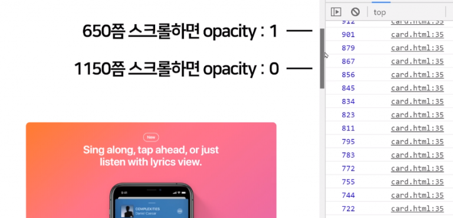
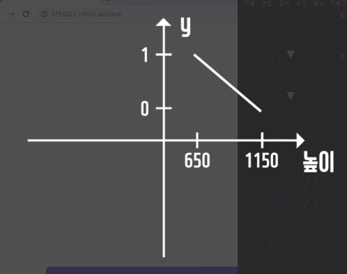

# 스크롤 위치에 따라 변하는 애니메이션 : Apple Music UI 만들기

- [창고사이트](apple.com/apple-music)

|apple Music|
|-|
||
|스크롤바를 일정부분 내리면 카드가 더 이상 올라가지 않고 정지|

<br>

HTML 준비
---
- 깨끗한 HTML 파일에 jQuery와 CSS 파일 첨부

  - 이미지 3개 배치

<br>

> HTML
```html
<div class="card-background">
  <div class="card-box">
    
  </div>
  <div class="card-box">
    
  </div>
  <div class="card-box">
    
  </div>
</div>
```

> css
```css
.card-background {
  height: 3000px;
  margin-top: 800px;
  margin-bottom: 1600px;
}

.card-box img {
  display: block;
  margin: auto;
  max-width: 80%;
}
.card-box {
  position: sticky;
  top: 400px;
  margin-top: 200px;
}
```
- 배경에 카드를 세로로 3개 배치

- position : sticky를 이용해 스크롤시 화면에 고정

<br>

---

<br>

스크롤 위치에 따라 opacity가 변하는 애니메이션
---
- 예제

  - 스크롤을 내릴 때 카드 opacity가 변하고 사이즈 축소 
  
<br> 

- 스크롤 위치에 따라 opacity가 0에서 1까지 무수히 많은 중간단계가 존재 

<br> 

> 스크롤시 내부 코드 실행
```js
$(window).scroll(function(){
    var 높이 = $(window).scrollTop();
    console.log(높이);
});
```
▲ 스크롤 애니메이션의 기본 

- 현재 창의 스크롤바 높이를 알려주는 (window).scrollTop(); 함수 사용

<br>

---

<br>
 

현재 창의 스크롤바 높이 출력 이유
---
- 현재 스크롤바 높이에 따라 opacity가 변하기 때문

  - 스크롤바가 어디까지 스크롤 되면 opacity가 0이고

    - 1150px 쯤 스크롤하면 opacity를 0으로 설정

      - 900px 쯤 스크롤하면 opacity를 대충 0.5로 설정

  - 어디까지 스크롤 되면 opacity가 1인지 찾기 위함

    - 650px 쯤 스크롤하면 opacity를 1로 설정


<br>

|-|
|-|
|| 

<br>

> javascript
```js
$(window).scroll(function(){

  var 높이 = $(window).scrollTop();
  console.log(높이);
        
// 650~1150까지 스크롤바를 내리면,
// 첫째카드의 opacity 1~0으로 서서히변경해주셈
  $('.card-box').eq(0).css('opacity', ???);

});
```
- 스크롤바를 내릴 때, $('.card-box').eq(0).css('opacity', ???); 이렇게 코드가 동작하도록 설정

  - 첫카드의 opacity를 ???로 변하게 해야되는데 ???는 0 등 고정된 값으로 설정 불가

    - ???부분 : `스크롤바높이가 650~1150이 될 때 1~0이 되는 가변적인 값`  

    - 일달ㄴ 미지의 변수인 y라고 표현 

 

 

 
> javascript
```js
$(window).scroll(function(){

  var 높이 = $(window).scrollTop();
  console.log(높이);

  var y = 미지의 변수;
  $('.card-box').eq(0).css('opacity', y);

});
```
- `스크롤바높이가 650~1150이 될 때 1~0이 되는 가변적인 값`(변수 y) 구하기

|1차함수 그래프|
|-|
||
|y = a * 높이 + b|
|높이가 650일 때 y가 1, 높이가 1150일 때 y가 0|

- y에 대한 1차함수는 기울기를 모를 때 ax+b 로 표현 가능

  - a : 기울기, b : y절편
  
    - a랑 b라는 미지수만 잘 구하면 y 구하기 가능

- a,b를 구하는건 대입법 이용

> 대입법
```
1 = a * 650 + b
0 = a * 1150 + b

a = -1/500
b = 115/50
```
 
> javascript
```js
var y = -1/500 * 높이 + 115/50
```
 
<br>

---

<br>
 

y를 이용한 코드 업데이트
---
> javascript
```js
$(window).scroll(function(){

  var 높이 = $(window).scrollTop();
  console.log(높이);

  var y =  -1/500 * 높이 + 115/50;
  $('.card-box').eq(0).css('opacity', y);

});
```
- 스크롤바 내리면 opacity라는 값이 y에 의해서 결정됨

  - y는 스크롤 높이가 변할 때마다 매번 바뀌기 때문

<br>

---

<br>

응용
---
- 카드가 0.9배 정도로 서서히 작아지는 것 구현

  - 현재 창을 650~1150만큼 스크롤 했을 때 카드의 크기가 1에서 0.9로 변경

- 사이즈를 줄이는건 transform : scale(0.9) 속성 이용

  - 미지의 변수 z 생성

  - z = a * 높이 + b 수식을 세운 뒤 대입법으로 a, b 상수 구하기

    - 높이가 650일 때 z는 1,

    - 높이가 1150일 때 z는 0.9 

> javascript
```js
$(window).scroll(function(){

  var 높이 = $(window).scrollTop();
  console.log(높이);

  var y =  -1/500 * 높이 + 115/50;
  $('.card-box').eq(0).css('opacity', y);

  var z = (-1/5000) * 높이 + 565/500;
  $('.card-box').eq(0).css('transform', `scale( ${z} )`);

});
```
- 스크롤바 내리면 transform : scale(z) 값이 z에 의해서 결정됨

- ${} : 글자 중간중간에 변수 삽입 스킬

- 더 부드러운 동작

  - card-box라는 div에 transition : all 0.2s 부여

<br>