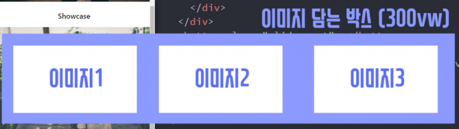

# 캐러셀에 스와이프 기능

캐러셀에 터치 & 스와이프 기능
---

> 예전에 만들었던 캐러셀 UI 소환
```html
<div style="overflow: hidden">
    <div class="slide-container">
      <div class="slide-box">
        
      </div>
      <div class="slide-box">
        
      </div>
      <div class="slide-box">
        
      </div>
    </div>
</div> 
```

|-|
|-|
||

- 폭이 300vw인 큰 박스 안에 작은 이미지 3개가 있는 레이아웃

- 버튼을 누르면 박스 전체를 -100vw 만큼 움직이게 만들어서 캐러셀 생성

- 캐러셀의 기능

    - 기능1. 드래그한 거리만큼 사진도 왼쪽으로 움직여야함

    - 기능2. 마우스 떼었을 때 일정거리 이상 이동했으면 사진2 보여줌, 아니면 다시 사진1 보여줌

<br>

---

<br>

mouse 이벤트 3개
---
- 마우스로 어떤 html 요소를 조작할 때 발동하는 이벤트

    - mousedown (어떤 요소에 마우스버튼 눌렀을 때)

    - mouseup (어떤 요소에 마우스버튼 뗐을 때)

    - mousemove (어떤 요소위에서 마우스 이동할 때)

<br>

> ex
```html
<div>캐러셀있는곳</div>

<script>
  $('.slide-box').eq(0).on('mousemove', function(){
    console.log('안녕')
  })
</script>
```
- .slide-box 위에 마우스 움직일 때 마다 `안녕` 출력

<br>

> ex
```html
<div>캐러셀있는곳</div>

<script>
  $('.slide-box').eq(0).on('mousemove', function(e){
    console.log(e.clientX)
  })
</script>
```
- mouse~ 이벤트리스너안에선 e.clientX e.clientY 출력 가능

    - 현재 마우스 좌표를 알려줌

    - 유저가 얼마나 사진을 드래그 했는지 알 수 있음

<br>

---

<br>

기능1. 사진1을 왼쪽으로 드래그한 거리만큼 사진1도 왼쪽으로 움직여야함
---
- 사진1을 클릭하고 왼쪽으로 50px 잡아끌었다면 사진1도 왼쪽으로 50px 움직여야함

    - 사진1만 움직이는거말고 사진3개 전부 담긴 큰 박스 움직이는게 좋음

- 이동거리 파악

    - 마우스 누를 때의 X좌표 & 마우스 움직일 때의 X좌표 빼면 됨

<BR>

> ex
```html
<div>캐러셀있는곳</div>

<script>
  $('.slide-box').eq(0).on('mousedown', function(e){
    e.clientX ← 이거랑
  });

  $('.slide-box').eq(0).on('mousemove', function(e){
    e.clientX ← 이거를 빼야할듯
  });
</script>
```
- e.clientX 두개 빼면 됨

- 모든 변수는 범위가 있어서 함수 바깥으로 탈출 불가

    - 함수 바깥에 있던 변수는 함수 안에서 맘대로 쓸 수 있음

        - 함수 바깥에 변수를 만들어두면 함수들끼리 변수 공유 가능

<br>

> ex
```js
<script>
  var 시작좌표 = 0;

  $('.slide-box').eq(0).on('mousedown', function(e){
    시작좌표 = e.clientX;
  });

  $('.slide-box').eq(0).on('mousemove', function(e){
    console.log(e.clientX - 시작좌표)
  });
</script>
```
- 시작좌표라는 변수를 함수들 바깥에 생성

    - 그럼 모든 함수에서 이용가능

- 마우스 클릭시 현재 좌표를 var 시작좌표에 저장해줌

- mousemove 이벤트발생시 var 시작좌표랑 현재좌표인 e.clientX를 빼봄

- 출력해보면 현재 드래그 이동거리 확인 가능

    - 왼쪽으로 드래그하면 `-100` 등, 오른쪽으로 드래그하면 `100` 등 출력

- 전역변수 : 모든지역에서 이용할 수 있는 변수들

<BR>

---

<br>

이동거리만큼 박스 이동
---
```js
<script>
  var 시작좌표 = 0;

  $('.slide-box').eq(0).on('mousedown', function(e){
    시작좌표 = e.clientX;
  });

  $('.slide-box').eq(0).on('mousemove', function(e){
    console.log(e.clientX - 시작좌표)
    $('.slide-container').css('transform', `translateX( ${e.clientX - 시작좌표}px )`)
  });
</script>
```
- translateX를 조절하면 박스가 왼쪽으로 오른쪽으로 이동

- margin-left 도 가능

- 약간 반응이 느린 이유

    - .slide-container 박스에 transition : all 1s; 추가했기 때문

        - transition css 코드를 삭제시 잘 작동 

<BR>

---

<BR>

마우스 클릭 안했는데 박스가 움직임
---
> `클릭하고나서만 박스 이동해달라`고 컴퓨터에게 명령
```js
<script>
  var 시작좌표 = 0;

  $('.slide-box').eq(0).on('mousedown', function(e){
    시작좌표 = e.clientX;
  });

  $('.slide-box').eq(0).on('mousemove', function(e){
    if (마우스눌렀냐???) {
      $('.slide-container').css('transform', `translateX( ${e.clientX - 시작좌표}px )`)
    }
  });
</script>
```
- if문 추가

- mousedown 이벤트리스너 이용해 마우스 눌렀는지 아닌지 판단

<br>

> 수정
```js
<script>
  var 시작좌표 = 0;

  $('.slide-box').eq(0).on('mousedown', function(e){
    시작좌표 = e.clientX;
    var 눌렀냐 = true;
  });

  $('.slide-box').eq(0).on('mousemove', function(e){
    if (눌렀냐 === true) {
      $('.slide-container').css('transform', `translateX( ${e.clientX - 시작좌표}px )`)
    }
  });
</script>
```
- 마우스 누르면 var 눌렀냐 변수를 true로 만들라고 코드 작성

- if문에선 var 눌렀냐가 true일 때만 박스움직이라고 코드 작성

    - 함수 안에 있던 변수는 함수 바깥으로 탈출 불가

    - 제대로 동작x → 실행해보면 var 눌렀냐라는 변수없다고 나옴     

        - 모든 곳에서 사용가능한 전역변수를 만들어 사용

> 최종 코드
```js
<script>
  let 시작좌표 = 0;
  let 눌렀냐 = false;

  $('.slide-box').eq(0).on('mousedown', function(e){
    시작좌표 = e.clientX;
    눌렀냐 = true;
  });

  $('.slide-box').eq(0).on('mousemove', function(e){
    if (눌렀냐 === true) {
      $('.slide-container').css('transform', `translateX( ${e.clientX - 시작좌표}px )`)
    }
  });
</script>
```
- 전역변수 만들었더니 변수 사용 가능

- 변수명 많아지면 중복생길까봐 let 변수 사용 

<br>
 
---

<br>

마우스 뗐는데도 박스 움직임
---
> `마우스 떼었을 때는 박스 움직이지 말라`고 컴퓨터에게 명령

```js

```

<br>

---

<br>
 
응용
---
- 마우스 떼었을 때 이동거리가 100 이상이면 2번사진 보여주기

  - 마우스를 떼면 실행할 기능이니까 mouseup 이벤트리스너안에 코드 작성

```js
<script>
  (생략)

  $('.slide-box').eq(0).on('mouseup', function(e){
    눌렀냐 = false;

    if (이동거리 100이상) {
      2번사진보여주셈 
    } else {
      1번사진보여주셈
    }
  });
</script>
``` 
 
<br>
 
### 💡 Q. 이동거리 구하기 
- e.clientX - 시작좌표

  - e.clientX - 시작좌표는 다른 함수안에 있어서 함부로 가져다쓰지 못함

  - 쓰고싶으면 전역변수 생성

> 수정 코드
```js
<script>
  (생략)

  $('.slide-box').eq(0).on('mouseup', function(e){
    눌렀냐 = false;

    if (e.clientX - 시작좌표 < -100) {
      $('.slide-container').css('transform', 'translateX(-100vw)');
    } else {
      $('.slide-container').css('transform', 'translateX(0vw)');
    }
  });
</script>
```
- 전역변수없이 그냥 e.clientX - 시작좌표 써도 이동거리가 잘 나옴

  - e.clientX 출력하면 '마우스 뗐을 때 좌표' 나옴

- 2번사진 보여주려면 박스를 -100vw 만큼 움직이면 됨

<br>

---

<br>

마우스 떼면 사진이 순간이동함
---
- 마우스 떼면 2번사진으로 이동하라고 코드짰기 때문

  - 서서히 이동하는 애니메이션주고 싶으면 이동할 박스에 css transition 추가

- 마우스 떼면 잠깐 0.5초정도 transition 붙였다가 떼어달라고 작성

  - 평소엔 transition이 필요가 없는데 사진에서 마우스를 떼면 transition이 필요

<br>

> 코드
```js
<script>
  (생략)

  $('.slide-box').eq(0).on('mouseup', function(e){
    눌렀냐 = false;

    if (e.clientX - 시작좌표 < -100) {
      $('.slide-container').css('transition', 'all 0.5s').css('transform', 'translateX(-100vw)');
    } else {
      $('.slide-container').css('transition', 'all 0.5s').css('transform', 'translateX(0vw)');
    }
    setTimeout(()=>{
      $('.slide-container').css('transition', 'none')
    }, 500)
    
  });
</script>
```
- 마우스 떼면 transition : all 0.5s 이거 부착하라고 코드 작성

  - jQuery는 점찍고 계속 추가 가능 
  
    - 쌩자바스크립트는 변경사항이 2개면 2줄 작성

- setTimeout 이용해서 0.5초 후에 transition : none을 주라고 코드 작성

<br>

---

<br>

모바일은 터치 이벤트리스너 달아야함 
---
- 사이트를 모바일기기로 테스트하고 싶으면 

  - 크롬개발자도구 좌상단 toggle device toolbar 버튼 클릭

- 모바일기기로 테스트해보면 스와이프 X

  - 마우스이벤트리스너를 달아놨기 때문

  - 모바일은 터치이벤트리스너를 달아줘야 터치에 반응

- 터치이벤트리스너

  - touchstart (터치시작시 발동)

  - touchmove (터치중일 때 계속 발동)

  - touchend (터치종료시 발동)

<br>

> 모바일 코드
```js
<script>
  $('.slide-box').eq(0).on('touchstart', function(){
    시작좌표 = e.touches[0].clientX;
    생략
  })

  $('.slide-box').eq(0).on('touchmove', function(){
    생략
  })

  $('.slide-box').eq(0).on('touchend', function(){
    생략
  })

</script>
```
- e.clientX를 e.touches[0].clientX 로 변경

  - 터치는 여러 손가락으로 할 수 있어서 그 중 몇번째 손가락인지 지정해줘야 함

- touchend 이벤트리스너에선 e.clientX 말고 e.changedTouches[0].clientX 사용

<br>

### 💡 PC 환경에서 안된다면?
- 기존걸 touch로 바꾸는게 아니라 touch 이벤트리스너3개를 하단에 추가


<br>

---

<br>

코드가 너무 길다면
---
- 자바스크립트는 외부 라이브러리 의존도가 언제나 높음

  - Hammer.js 가져다쓰면 조금 쉽게 기능개발 가능

- 브라우저 호환성도 알아서 잡아주고

- 이벤트리스너 6개대신 1개만 써도 되고 

- 스와이프, pinch, rotate 등 여러 제스쳐를 감지하는 이벤트리스너 제공해서 편리

<br>

---

<br>

정리
---
1. 유저의 터치를 여러방식으로 감지할 수 있음

2. 터치좌표, 터치이동거리도 출력해볼 수 있음 

<br> 

- 구현하고 싶은 기능과 동작방식을 한글로 상세히 설명부터 하고

- 작고 쉬운 것 부터 개발

 
<br>


