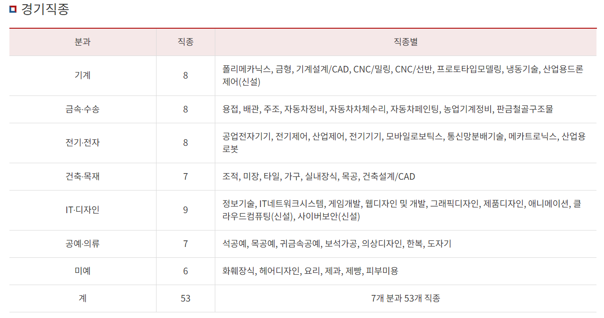
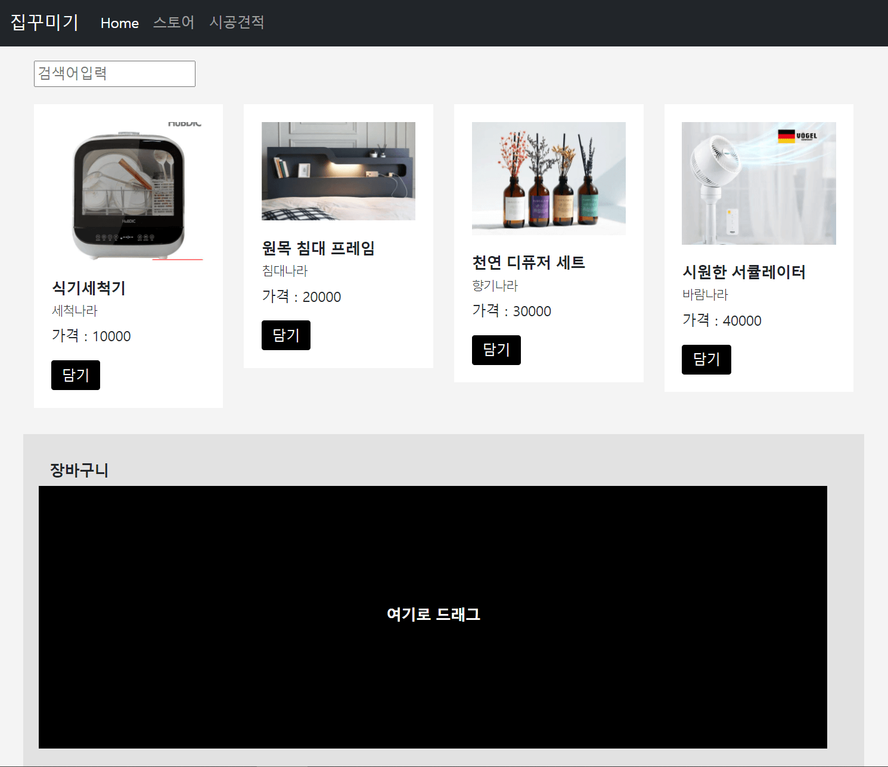
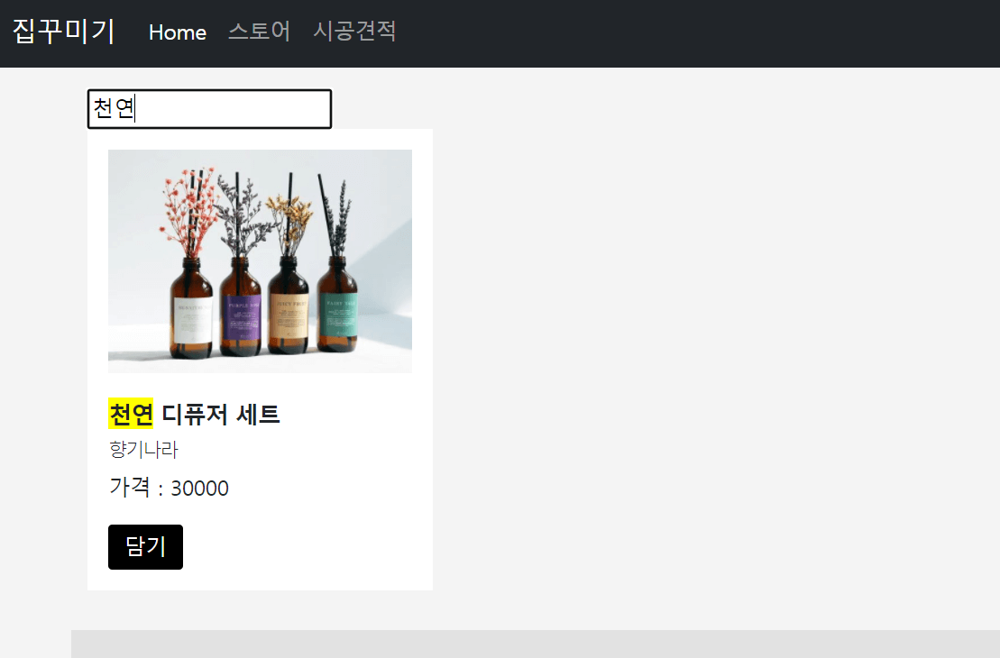
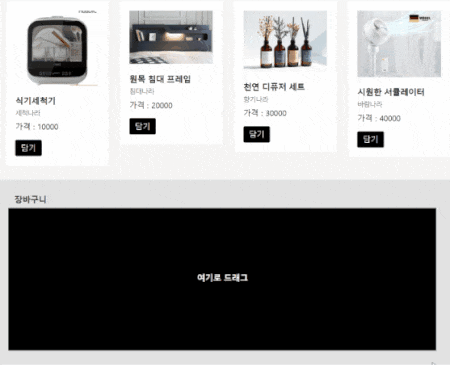
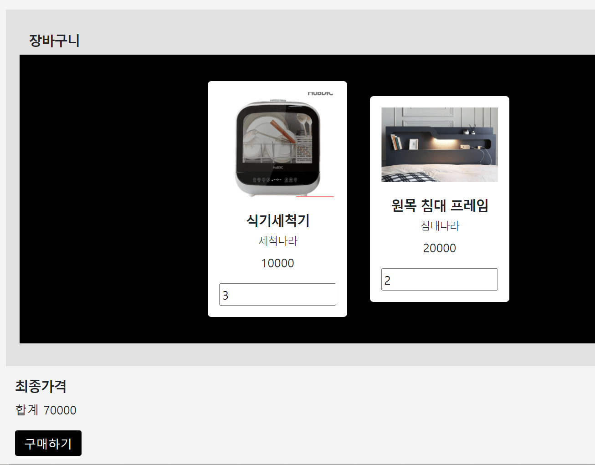
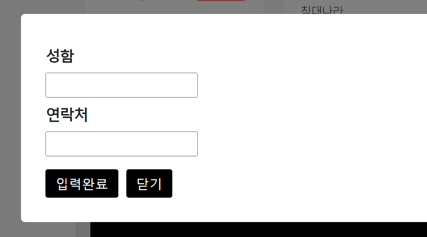
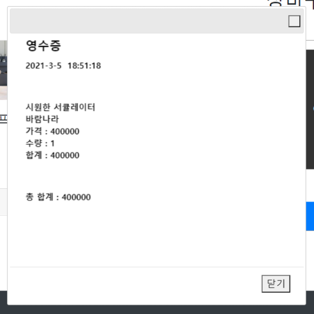

# 전국기능경기대회

|-|
|-|
||

- 기술진흥원에서 매년 이런 주제로 대회를 개최하고 시상

- 웹디자인 & 개발 분야는 인터넷 접속 안되는 컴퓨터와 코드 에디터 하나 제공

    - 10시간 동안 열심히 프론트엔드와 서버 만들고 오면 ok

        - 실은 문제를 일주일 전에 미리 줘서 답안 외워감

- 출제하는 문제들이 자바스크립트 연습해보기 좋음

- 목표는 하단에 설명하는 기능을 가진 HTML 파일 생성

<br>

---

<br>

|-|
|-|
||

## Q1. 만들 HTML파일은 위 사진과 비슷한 레이아웃을 구성

- 디자인 잘했는지 평가는 안하니 Bootstrap 사용하면 빠름

- 상품목록은 .json 파일로 제공되는데 그 파일에 있는 데이터를 넣어야함

- ajax get 요청으로도 로컬 json파일에 있는 데이터를 가져올 수 있음

<br>

---

<br>
 
|-|
|-|
||

## Q2. 상품 검색 기능이 필요

- 상단 \<input>에 검색어를 입력하면 그 글자가 제목, 업체명에 들어있으면 그 상품만 보여줘야함

- 찾은 글자에 노란색 배경을 입히기

<br>

### 💡 힌트
 

1. 이미 있는 상품목록을 숨기는 식으로 코드짜는 것 보다는 list.html 필터기능 만들었던 것 처럼 카드 전부 지웠다가 원하는 카드만 재생성하는게 편리

 

2. 문자안에 특정 문자가 들어있는지 검사하고 싶으면 .includes() 아니면 .indexOf() 사용

 

3. HTML중간중간 원하는 글자에 노란색 배경입히는건 html과 css 잘하면 됨

> ex
```html
<p>안녕하세요</p> 를 

<p><span style="background : yellow">안</span>녕하세요</p>
```
- 이렇게 바꾸면 원하는 곳만 노랗게 바꿀 수 있음

<br>

---

<br>

|-|
|-|
||


## Q3. 위 사진 처럼 장바구니로 상품을 드래그할 수 있게 생성

- 상품을 드래그해서 검은 박스에 놓으면 카드가 하나 생성됨

- 담기버튼눌러도 똑같이 카드 생성

- 이미 있는 상품이면 카드생성이 아니라 수량만 1 증가

<br>

### 💡 드래그 & 드롭 이벤트
- 어떤 요소를 잡아끌면 drag 이벤트, 마우스 떼어서 놓은 곳에선 drop 이벤트 발생

- 스와이프와 다른 점

    - html 요소를 a에서 b로 이동시키는걸 감지해주는 이벤트

- 어떤 html 요소를 드래그 & 드롭할 때 특정 코드를 실행하고 싶으면 [참고](https://www.w3schools.com/html/tryit.asp?filename=tryhtml5_draganddrop)

<br>

> 참고
- 어떤 \<div> 를 드래그되게 만들고 싶으면 \<div draggable="true"> 를 일단 입력

 

- 어떤 요소를 드래그 시작시엔 dragstart 이벤트, 어딘가에 드랍할 때는 드랍한 곳에서 drop 이벤트 발동

    - 이벤트명으로 이벤트리스너 붙이면 그 상황에서 코드실행가능

    - 드랍할 곳에는 dragover 이벤트리스너 붙여서 e.preventDefault() 실행해줘야 drop 이벤트리스너가 잘 실행됨 

- 유저가 지금 드래그한 요소가 몇번째 상품인지 알고싶으면 

    - 드래그한 요소에 몰래 상품번호 데이터같은걸 숨겨놓고 잠깐 변수나 미지의 세계에 저장하면 됨

<br>
 
> 미지의세계
```js
e.dataTransfer.setData('작명', '저장할데이터')
e.dataTransfer.getData('작명') 
```
- 드래그/드랍 요소간 데이터공유를 쉽게 도와주는 기본기능

- jQuery이벤트리스너 안에선 e.originalEvent.dataTransfer.setData() 
 
<br>

---

<br>

|최종가격계산 예시|
|-|
||
 
|구매하기 누를 때 뜨는 모달창 예시|
|-|
||

## Q4. 나머지

- 장바구니 개별 항목의 주문 수량을 변경할 수 있어야함

- 모든 상품과 수량의 최종 합계 금액을 어딘가 보여주어야함

- 구매하기를 누르면 성함 연락처를 입력할 수 있는 모달창을 띄워줘야함

<br>

---

<br>

|-|
|-|
||

## Q5. 모달창에서 구매완료 누르면 영수증을 이미지형태로 보여줘야함

- 현재 날짜, 주문한 모든 상품명 & 가격, 총 합계금액이 나오면 됨

- 이미지 만드는건 \<canvas> 태그 이용

- 자바스크립트쓰면 \<canvas>안에 사진넣고 텍스트 입력도 가능

 
<br>

> canvas에 텍스트 입력하는 법
```html
<canvas id="canvas" width="350" height="350"></canvas> 

<script> 
  var canvas = document.getElementById('canvas'); 
  var c = canvas.getContext('2d');
  c.font = '20px dotum';
  c.fillText('안녕하세요', 30, 20);
  c.fillText('반갑습니다', 30, 50); 
</script> 
```
- HTML어딘가에  이런 태그를 만들어줌

    - 가로세로 높이도 맘대로 지정 가능

- canvas 태그를 자바스크립트 셀렉터로 찾아줌

    - 그 다음에 getContext('2d') 붙이면 자유롭게 내용입력 가능

- 점찍고.font 하면 자유롭게 폰트설정 가능

- 점찍고.fillText(내용, x좌표, y좌표) 하면 canvas태그 내의 특정 좌표에 원하는 글씨 입력 가능

- canvas안에 적은 내용들은 전부 이미지처럼 사용 가능

<br>

---

<br>

# 답안(testex.html)
- 모범답안 충족 조건

    - 버그없고

    - 나중에 수정도 편리하고

    - 상품의 양이 많아져도 문제없고

    - 여러분이 보기편한 코드

<br> 

> 참고사항

- 디자인 생략함

- 기능구현에 필요한 최소한만 작성

    - 실제 사이트라면 필요할 것 같은 추가기능 추가

- 반복적인 긴 코드들은 함수로 만들어서 재사용

- 코드가 길면 외부 js 파일로 빼기

<br>

> 예외상황에 대응하는 코드 작성

- 검색어에 해당하는 상품이 없는 경우?

- 수량을 0으로 만들어서 주문하기 버튼을 누르는 경우?

- json 데이터를 가져와야하는데 데이터가 없는 경우?

<br>


 

 

 